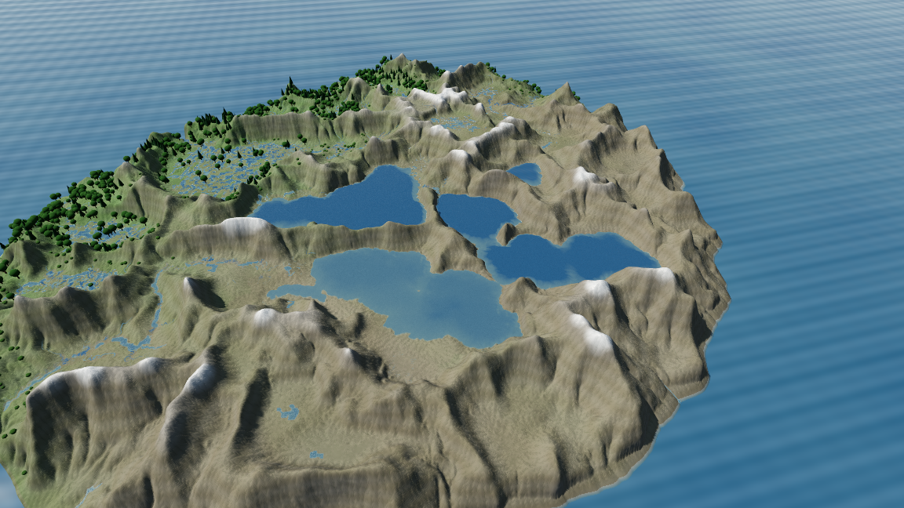
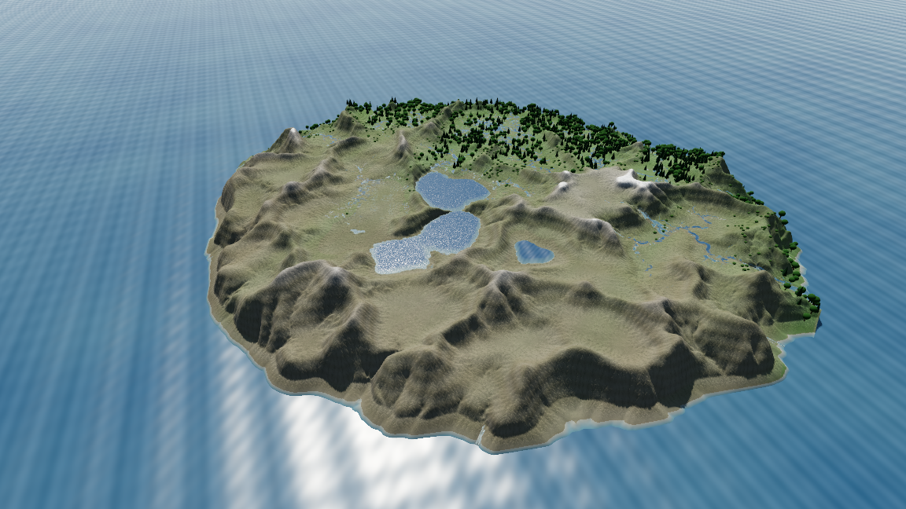
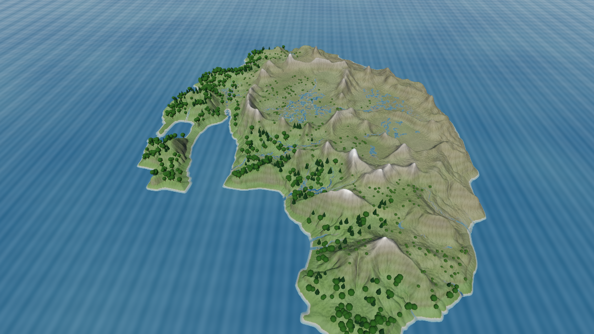

# river-sim

Interaktive Landschafts-Evolution: ein prozedural erzeugtes Insel-Terrain, das
über Jahrtausende im Zeitraffer erodiert — Flüsse schneiden Täler, Mäander
wandern, Seen entstehen und verlanden. Simulationskern in reinem Swift,
Rendering und Interaktion in Godot 4 (via GDExtension/SwiftGodot).



| 100.000 Jahre (gleicher Seed) | anderer Seed |
| --- | --- |
|  |  |

## Was drinsteckt

- **Fluviale Inzision** — FastScape-Stream-Power mit implizitem Solver,
  stabil auch bei 10.000-Jahr-Schritten.
- **Droplet-Hydraulik-Erosion** (nickmcd/Lague) — carvt feines dendritisches
  Detail; Stream-Map aus zeitgemittelten Tropfenpfaden.
- **Entwässerung** — Priority-Flood, MFD-Einzugsgebiete, Becken entwässern
  über Auslass-Inzision statt vollzulaufen.
- **Mäander-Migration** — wandernde Zentrumslinien, die ihr eigenes Bett
  carven; Altarm-Seen und Verlandung.
- **Pre-Erosion** — Port des [runevision-Erosionsfilters](docs/references/runevision-erosion/README.md),
  damit das Terrain schon „gealtert" startet.
- **Klima** — orographischer Niederschlag, Vegetation als Erosionsschutz,
  Hangprozesse, Küsten-Wellenerosion.
- **Welten speichern und laden** — der vollständige Sim-Zustand in einer
  versionierten Datei; ein geladener Spielstand läuft bit-identisch weiter
  ([docs/world-save-format.md](docs/world-save-format.md)).

Details: [SimCore/README.md](SimCore/README.md) und [docs/](docs/).

## Bauen & Starten

### macOS

Voraussetzungen: Swift 6-Toolchain (Xcode), [Godot 4](https://godotengine.org)
(getestet mit 4.7).

```sh
./scripts/build.sh          # baut die GDExtension nach game/bin/ und signiert sie
godot --path game           # oder game/project.godot im Godot-Editor öffnen
```

### Debian / Linux

Swift 6 wird benötigt (z. B. über Swiftly); Godot holt sich das Repo selbst in
der gepinnten Version nach `.tools/`:

```sh
./scripts/fetch-godot.sh    # Godot herunterladen und Prüfsumme verifizieren
./scripts/build.sh
./scripts/start.sh
```

`GODOT=/pfad/zu/godot ./scripts/start.sh` nutzt eine andere Godot-Installation.
Auf einer Maschine ohne Vulkan-Unterstützung startet
`./scripts/start.sh --rendering-method gl_compatibility`; ohne Display ist nur
der headless Modus sinnvoll.

Steuerung: Linksklick formt das Terrain (Shift kehrt um), Rechtsklick dreht,
`+`/`−` oder Pinch zoomt. Die Zeitraffer-Knöpfe (10/30/60 J/s, +100 bis
+10.000 Jahre) treiben die Simulation. **F5** speichert die Welt nach
`user://saves/welt.rsworld`, **F9** holt sie zurück (Knöpfe 💾/📂 im Panel
„WELT"); nach dem Laden ist die Simulation pausiert.

### Leistung und Diagnose

Standard ist `RS_QUALITY=balanced`: Die Simulation bleibt bei 832×832, das
Terrain-Displacement nutzt aber ein 384×384-Gitter. `RS_QUALITY=quality` nutzt
die volle Geometrie; `RS_QUALITY=performance` verwendet 256×256, deaktiviert
SSAO, Glow und den kostspieligen Detail-Erosionsshader. `RS_RENDER_GRID=512`
überschreibt nur die Gittergröße. `RS_DIAG=1` gibt die Zeit eines 60-Jahr-
Simulationsschritts und zehn Texture-Updates aus.

Die Diagnosekarte im Spiel zeigt Höhenbereich, Landrelief (Spanne max − min und
daneben das robuste Servo-Regelsignal p95 − Median) sowie Höhen- und
Netto-Volumenabweichungen gegenüber einer frei setzbaren Referenz und den Zustand der
Relief-Servo. Die umschaltbare Δ-Karte färbt Abtrag blau und Aufbau rot. Nach
dem Einebnen sollte **Referenz setzen** gedrückt werden; dadurch wird sichtbar,
ob anschließend Täler eingeschnitten oder tatsächlich Berge aufgebaut werden.
`RS_DEBUG_DIFF=1` aktiviert die Δ-Karte für automatisierte Screenshots.

## Tests

Der Kern ist Godot-frei und headless verifizierbar:

```sh
swift test -c release --package-path SimCore
```

## Lizenz

[0BSD](LICENSE). Ausnahme: `ErosionFilter.swift` und der Referenz-Shader sind
MPL-2.0 (© Rune Skovbo Johansen), Details in [NOTICE](NOTICE).
