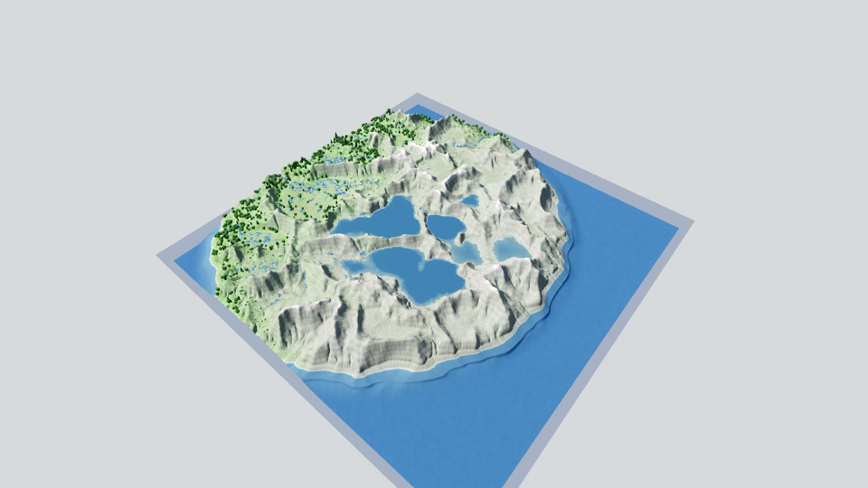
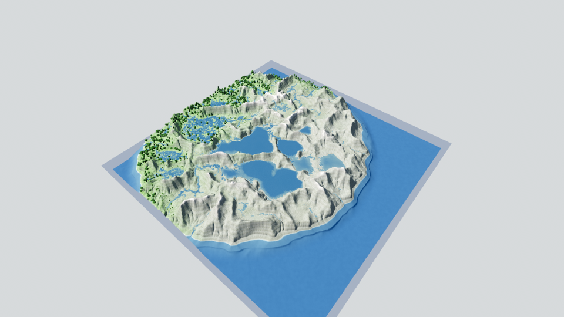
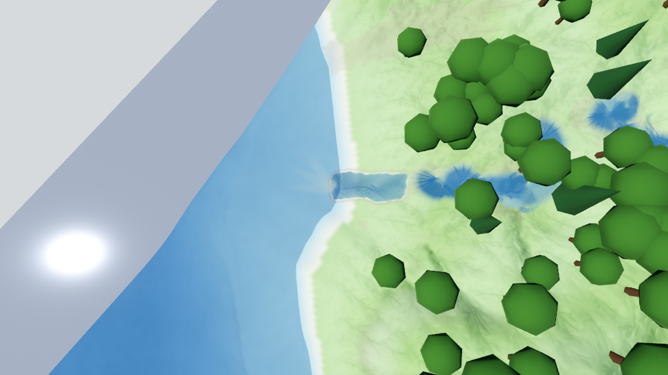
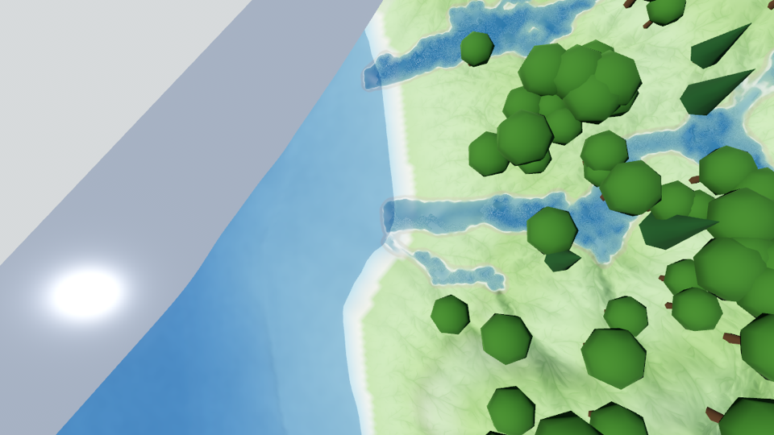
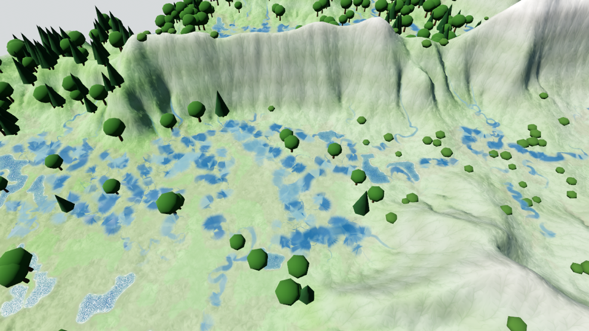
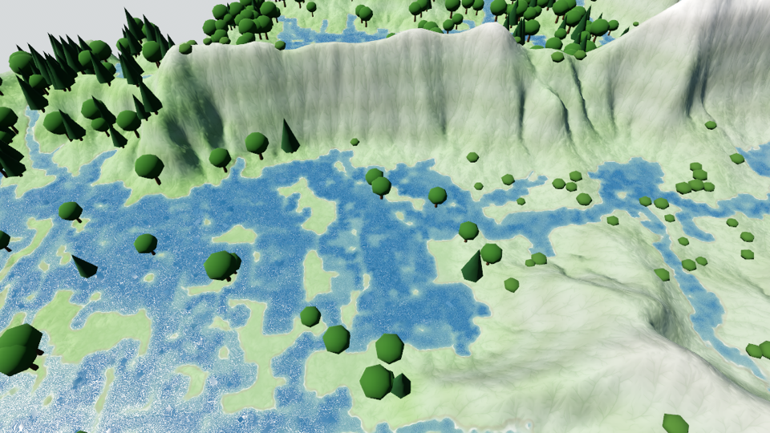

# Wasser als Geometrie: Mündungen, Deltas, Altarme (Issue #34)

Messprotokoll zum Abschluss des Geometrie-Umbaus (#31 Ribbons, #32 Seeufer, #34
Mündungen/Deltas/Altarme + Ablösung des Raster-Stempels). Alle Zahlen auf dem
M4-Max-Referenz-Mac, Godot 4.7.1, `n = 832`, `world = 130`.

Reproduzieren:

```sh
GODOT=…
"$GODOT" --headless --path game --script res://tests/water_geometry.gd   # Wächter
RS_SEED=907 RS_STEP=60000 "$GODOT" --headless --path game --script res://tests/water_geometry.gd  # Messlauf
RS_SEED=1337 RS_STEP=20000 RS_DIST=170 RS_SHOT=/tmp/a.png "$GODOT" --path game            # neu (Standard)
RS_WATER_STAMP=1 RS_SEED=1337 RS_STEP=20000 RS_DIST=170 RS_SHOT=/tmp/b.png "$GODOT" --path game  # alt (Stempel)
```

---

## A. Was die Sim an einer Mündung wirklich baut

Vor dem ersten Codezeilen-Schreiben gemessen (Ausgangsfrage: „woran erkennt man
ein Delta?"). Profil der Wassersäule entlang der Empfänger-Kette ab der
Uferlinie, an den 14 größten Mündungen, Seed 1337, Jahr 20.000:

| Mündung (i,j) | Einzugsgebiet (Zellen) | Wassersäule ab Ufer (16 Zellen) |
|---|---|---|
| (305,813) | 96.890 | 0.005 0.000 0.005 0.008 0.007 0.013 … 0.069 |
| (264,669) | 82.837 | 0.003 0.003 0.002 0.001 … 0.009 |
| (271,649) | 81.560 | 0.017 0.018 0.014 0.011 … 0.018 |
| (340,615) | 65.630 | **0.049** 0.046 0.044 0.038 … 0.023 |
| (354,595) | 65.416 | **0.037** 0.039 0.044 0.048 … 0.048 |
| (468,582) | 63.990 | **0.026** 0.023 0.023 0.015 … 0.022 |

Zwei Befunde, die den Entwurf bestimmt haben:

1. **Es gibt keine scharfe geologische Delta-Front.** Die Wassersäule steigt
   entweder langsam über viele Zellen (flacher Ablagerungskörper) oder liegt
   sofort bei 0.03–0.05 (Steilufer). Eine Schwelle „Delta = Tiefe < x" wäre
   also willkürlich gewesen — sie hätte auf jeder flachen Bucht ausgelöst.
   Kontrollgruppe (12 zufällige Küstenpunkte OHNE Fluss): im Mittel 48 Zellen
   unter 0.02 Wassersäule, also genauso flach wie an Mündungen.
2. **Es gibt eine scharfe RENDER-Grenze.** Das Raster-Wasserfeld malt eine
   Fläche erst ab `rawWet` = 0.03 Wassersäule als See (seichteres Ponding
   bleibt bewusst trocken, sonst „zu viele Seen"). Genau davor liegt eine Zone,
   die bisher **niemand** gemalt hat — der Saum zwischen Uferlinie und offenem
   Wasser.

Daraus die Leitregel von #34: **die Geometrie malt genau diese Zone, und hört
auf, wo das Raster übernimmt.** `WaterRender.deltaFrontDepth` IST deshalb
`WaterRender.lakeRawWetDepth` und keine zweite Kalibrierung daneben. Kein Spalt
(dazwischen liegt nichts Ungemaltes), kein doppeltes Wasser (übereinander liegt
nichts doppelt Gemaltes).

Das Meer folgt einer eigenen Regel: es ist keine Feld-Fläche, sondern eine
eigene Wasser-EBENE über der ganzen Karte, die ab der ersten Zelle unter `sea`
deckt. Dort gibt es nichts zu überbrücken — das Band blendet nach der STRECKE
aus (`mouthOverlapCells` = 2 Zellen), gerade genug, um den Diskretisierungs-
Versatz zwischen zell-gerundeter Zentrumslinie und per-Pixel-Uferkontur zu
schließen.

## B. Wächter-Zahlen (headless, `tests/water_geometry.gd`)

| Welt | Fluss-Bänder | Delta-Arme | Altarm-Bänder | Mündungen im Wasser | **mit Spalt** | max. Fluss-Alpha im Raster-Seewasser |
|---|---|---|---|---|---|---|
| Vorgabewelt, 20.000 J. | 248 | 20 | 65 | 116 | **0** | **0.0** |
| Seed 1337, 20.000 J. | 218 | 12 | 55 | 87 | **0** | **0.0** |
| Seed 1337, 60.000 J. | 263 | 12 | 5 | 4 | **0** | **0.0** |
| Seed 907, 20.000 J. | 72 | 6 | 6 | 3 | **0** | **0.0** |
| Seed 907, 60.000 J. | 66 | 9 | 0 | 0 | **0** | **0.0** |

- „Mit Spalt" zählt Fluss-Bänder, deren Ende TROCKEN liegt, obwohl der Lauf
  binnen 8 Zellen Wasser erreicht. Vor der Mündungs-Verlängerung: 8 (Seed 1337,
  20.000 J.), danach 0.
- „Max. Fluss-Alpha im Raster-Seewasser" ist die Overdraw-Probe: über jeder
  Zelle, die der See-Kanal malt (Wassersäule ≥ 0.03), muss die Band-Deckkraft 0
  sein. Vor der Übergabe-Regel: 1.0.
- Altarm-Bänder fallen mit der Zeit (55 → 5 bei Seed 1337): die Sim verlandet
  die Bögen, und `oxbowMaxAge` blendet den Rest aus. Seed 907 hat nach 60.000
  Jahren keinen wassergefüllten Altarm mehr — deshalb prüft der Wächter die
  EXISTENZ von Altarmen/Deltas nur in seiner Vorgabewelt und behandelt
  `RS_SEED`/`RS_STEP`-Läufe als Messläufe (Invarianten bleiben scharf).

## C. Drei Fehlerbilder, die erst der A/B-Screenshot gezeigt hat

Headless-Zahlen sagen nichts über Farbe und Höhe. Diese drei standen in keiner
Kennzahl:

1. **Dunkle Altarm-Haken auf der Seefläche.** Ein Altarm, der unter einem
   späteren See liegt, wurde vom Band gemalt UND vom See-Kanal — als dunkler
   Bogen auf hellem Blau. Fix: die See-Übergabe (`lakeHandoverFade`) gilt auch
   für Altarme; ein tief gefüllter Altarm IST ein kleiner See und wird als
   solcher gerendert (Uferkontur + Komponenten-Fade aus #32).
2. **Schwebende Platte vor jeder Meeres-Mündung.** Das Band lag auf
   `Wasserspiegel + RIVER_LIFT` (0.35 Welt-Y) — über der Meeres-Ebene statt in
   ihr. Zusätzlich stempelte der Korridor-Halo den Ufer-Saum auf den
   MEERESGRUND: dort ist `pond` per Definition 0, der Saum also voll
   eingeschaltet, und unter der durchscheinenden Wasser-Ebene stand ein helles
   Sand-Rechteck. Fix: Bänder auf Wasser liegen auf dem Spiegel (am Meer knapp
   darunter, dann lesen sie sich als Trübung IM Wasser), und der Korridor
   stempelt nicht unter die Meeresoberfläche.
3. **Drei helle Strahlen statt eines Fächers.** Die Delta-Arme waren so breit
   wie der Lauf und liefen mit voller Deckkraft bis zum Längen-Deckel (14
   Zellen) — auf flachen Schelfen quer durch die halbe Bucht. Fix: Mindest-
   Armbreite (der Strom verliert an der Mündung seine Tiefe, nicht sein
   Wasser), Deckkraft 0.55 → 0.35, Deckel 14 → 10 Zellen.

## D. Was BEWUSST Raster bleibt

| Anteil | Pfad | Begründung |
|---|---|---|
| Mäander-Hauptläufe, Deltas, Altarme | **Geometrie** | Persistente Entitäten mit Zentrumslinie; Breite ∝ √Abfluss statt Zell-Quantisierung |
| Dendritische Zubringer unter der Mäander-Schwelle (Stream-Map × MFD) | **Raster** | Sie haben keine Zentrumslinien-Entität, aus der ein Band entstehen könnte — und sie tragen den größten Teil der Talzeichnung. Ein Band je Rinnsal wäre die alte „zu viele Flüsse"-Optik in teuer. |
| Braid-Sprenkel (Nebenarme aus dem MFD-Netz) | **Raster** | Dasselbe Argument; Braiding ist eine FLÄCHEN-Eigenschaft (Bänke/Arme), keine Linie |
| Seen und Meer | **Raster + Shader** | Die Uferlinie entsteht seit #32 PRO PIXEL aus der Wassersäule — feiner, als eine Kontur-Triangulierung es könnte |
| Nass-Saum (`shore`) um alles | **Raster** | Er ist ein LAND-Effekt auf der Terrain-Farbe, keine Wasserfläche |

Was **abgelöst** ist: der Zentrumslinien-Stempel (malte den Lauf ins Wasserfeld;
trägt jetzt nur noch Saum-Intensität als Nass-Halo unter dem Band) und das
Altarm-Overlay im See-Kanal. Beides ist über `RS_WATER_STAMP=1` weiter
lauffähig — als A/B-Vergleichsarm, nicht als Alternative.

## E. Perf (M4 Max, `RS_FPS`, Zeitraffer 60 J/s, Übersicht `RS_DIST=170`)

| Messung | Geometrie (Standard) | Stempel (`RS_WATER_STAMP`) |
|---|---|---|
| FPS im Zeitraffer (3 Läufe) | 25,7 / 26,3 / 25,6 | 27,6 / 29,3 / 29,3 |
| FPS im Leerlauf (2 Läufe) | 79,6 / 80,1 | 80,0 / 79,0 |
| `terrain_texupload_ms` (RS_DIAG, 10×) | 16,3 | 13,8 |
| `buildRiverRibbons` (Wächter) | 3,6–7,8 ms | — |
| `step(60 J.)` | 114,1 ms | 115,1 ms |

Lesart: **im Leerlauf kostet die Geometrie nichts** (die zusätzliche Fläche mit
~60.000 Vertices ist gegen das Terrain-Displacement unsichtbar). Die ~10 % im
Zeitraffer stecken fast vollständig in der Wasser-Aufbereitung pro Textur-Update
(+2,5 ms): der Korridor-Halo deckt im Geometrie-Modus die volle Bandbreite
(Radius bis 4 Zellen statt 1). `buildRiverRibbons` selbst ist mit ≤ 8 ms bei
1 Hz Deckel nachrangig. Drei Vollbild-Schleifen wurden dafür in EINE
zusammengelegt (`rawWet` + Korridor-Deckel + Altarm-Saum): 16,7 → 16,3 ms.
Die Sim-Zeit ist unberührt (114 vs. 115 ms — Rauschen), wie es sein muss.

## F. Optik-Vergleich (A/B, Seed 1337, Jahr 20.000)

| Neu (Geometrie) | Alt (Stempel) |
|---|---|
|  |  |
|  |  |
|  |  |

- **Übersicht:** der Stempel-Pfad sprenkelt die Ebenen mit blauen Flecken
  (Zentrumslinien-Stempel + Altarm-Overlay über verknäulten Altpfaden). Die
  Geometrie zeigt Seen als Seen und Läufe als Linien.
- **Mündung (Aufsicht, Meeresküste):** links läuft das Band bis in die
  Uferkontur und blendet dort aus, davor liegt der Delta-Fächer als schwache
  Trübungsfahne. Rechts endet der gestempelte Lauf als breiter blauer Klecks vor
  der Küste.
- **Aue (Braid-Ebene):** der deutlichste Unterschied. Der Stempel-Pfad flutet
  die Ebene flächig blau („zu viel Wasser"), die Geometrie zeigt einzelne Arme
  und Tümpel mit trockenem Land dazwischen.

## G. Wächter

- `SimCoreTests/WaterRenderTests.swift` — pinnt die neuen Kalibrier-PAARUNGEN
  (Delta-Front == Raster-See-Schwelle, Typ-Kanal ↔ Shader-Gewichte) und
  vergleicht sie gegen den echten Quelltext von `water.gdshader` und
  `SimNode.swift`.
- `game/tests/water_geometry.gd` — Mündungs-Abschluss, Overdraw, Typen,
  Stillwasser-Kodierung, Physik-Neutralität, Determinismus.
- `game/tests/river_ribbons.gd` — der Band-Vertrag aus #31, um die
  Wasserspiegel-Ausnahme erweitert.
