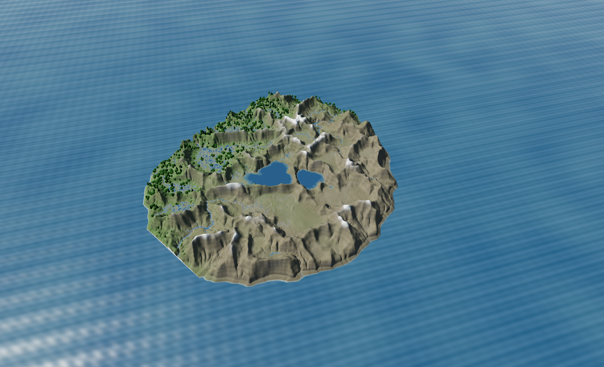
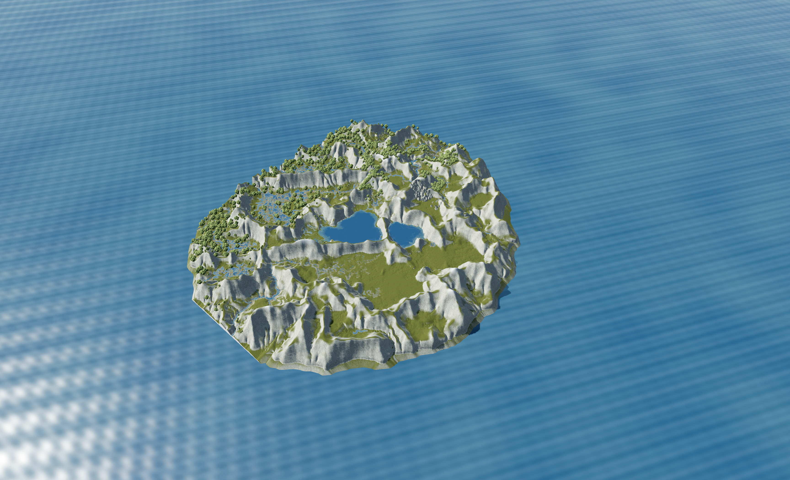
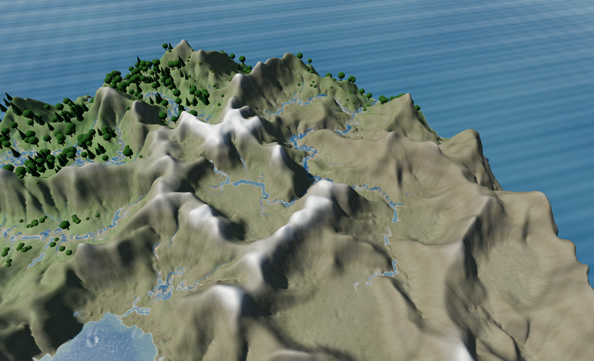
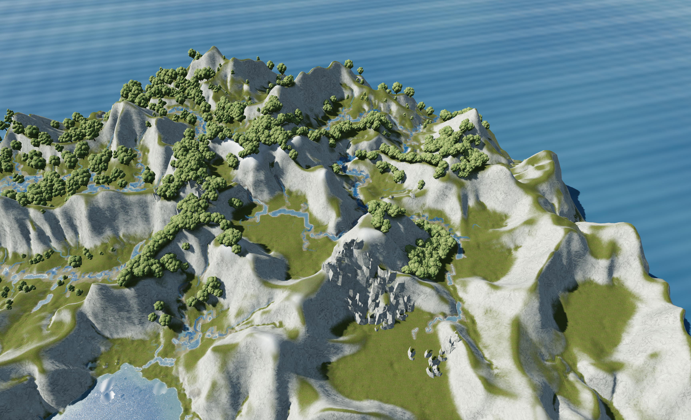

# Landschaftsqualität: Flusstal-Studie #116

Stand: 10. September 2026. Ausführbarer Prototyp, visuelle Abnahme noch offen.
Teil 2, Issue #117, beginnt erst nach ausdrücklicher Bestätigung des Bildsprungs.

## Abgestimmtes Ziel

Der Projekteigner hat ein stärker felsiges, dramatisches Tal nach dem Vorbild
der Soča gewählt. Helle gebrochene Felsflächen sollen sich von dunkleren
Waldgruppen absetzen, der Fluss muss auch aus der normalen Übersicht lesbar sein.
Das ist eine Bildstudie auf einer unveränderten Simulationswelt.

Zielmaschine ist der Apple M4 Max mit 40 GPU-Kernen und 64 GB RAM. Die zunächst
genannten 6016×3260 Pixel wurden vom Projekteigner auf das aktuell angeschlossene
interne Display korrigiert. Verbindlich sind **3456×2104 Viewport-Pixel im
maximierten Fenster**, bei höchstens **33,3 ms pro gerendertem Frame**.
Die Panelauflösung ist 3456×2234; Fensterrahmen und Menüleiste gehören nicht zum Viewport.

## Referenzen und Bildentscheidungen

| Bildquelle | Übernommene Eigenschaft |
| --- | --- |
| [Soča, Luftbild auf der Website des Tourismusverbands](https://www.soca-valley.com/en/accommodation/), [Bilddatei](https://www.soca-valley.com/images/backgrounds/vstopna-pomlad.webp) | Unregelmäßige dichte Kronen, dunkle Zwischenräume, heller mineralischer Flussrand. Hauptreferenz nach der Abstimmung. |
| [Große Soča-Schlucht bei Pristava Lepena](https://pristava-lepena.com/en/attraction/velika-korita), [Bilddatei](https://lepena-admin.morozov.si/uploads/DJI_6695_min_593d817c7b.jpg) | Gebrochene Felsufer und deutlich unterschiedliche Maßstäbe von Felswand, Block und Baumkrone. |
| [Isar im Vorkarwendel, LBV, Foto Dr. Olaf Broders](https://bad-toelz.lbv.de/unsere-arbeit/gebietsbetreuung-moore-und-isar/projektgebiet-isar/) | Offene Uferflächen und Waldgruppen als ursprünglicher Alternativvorschlag. Die breiten Kiesbänke sind nicht das gewählte Hauptmotiv. |

Diese Fotos sind ausschließlich verlinkte Referenzen. Sie sind keine Spielassets;
eine Erlaubnis zur Weiterverteilung der Fotos wird nicht behauptet.

Die erste aktuelle Aufnahme zeigte ähnlich texturierte große Hänge, einzelne
kugelige Kronen und wenig Kontrast zwischen Talboden und Fels. Historische
Screenshots waren nicht die Grundlage des A/B-Vergleichs.

Die Studie verändert folgende Darstellungsteile:

- Farbe, Normalen und Rauheit aus zwei zusammen verwendeten PBR-Materialien.
  Der Fels wird entsättigt und auf ein helles Kalksteinbild abgestimmt; dieselbe
  Materialfunktion gilt für die zusätzlichen Blöcke. Waldgrund ist dunkler.
- Mehrteilige, deterministische Baumkronen statt einer Kugel oder eines Kegels.
  Die bestehenden SimRender-Transform-Puffer bleiben erhalten.
- Sechs von Hand gewählte Waldgruppen und drei Felszüge im Ausschnitt.
  Der feste Zufallsseed 116 verteilt Instanzen nur innerhalb dieser Komposition.
  Das ist keine allgemeine Verteilung für andere Welten.
- Seitlicheres Licht: Sonnenposition von `(-60,120,60)` auf `(-80,105,50)`,
  Lichtfarbe von `(1,.95,.88)` auf `(1,.97,.91)`, Belichtung von `.68` auf `.78`,
  Umgebungsenergie von `.28` auf `.42`, Nebeldichte von `.0006` auf `.0012`.
  ACES, die Sim-Höhen und sämtliche Wasser-Uniforms bleiben bestehen.

Verworfene Zwischenstände: Die unmodifizierte orange Felsfarbe passte nicht zur
Soča-Richtung. Gestapelte rundliche Felskörper wirkten wie aufgesetzte Türme.
Die aktuelle Fassung verwendet niedrigere zusammenhängende gebrochene Blöcke.

## Reproduktion

Ausgangscommit: `9dece54ce0948e4d76ff0d59de5ba6ee0022a76e`.
Godot: `4.7.1.stable.official.a13da4feb`, Metal Forward+.
Die vorhandene macOS-Extension bestand den Build-Stempel-Check. Kein lokaler
Extension-Build wurde ausgeführt. #94 und #95 waren bei Beginn noch offen;
die Studie benutzt die bestehenden Puffer und ändert deren Frame-Protokoll nicht.

`scripts/graphics-study.sh` legt Seed 1337, 20.000 Vorlaufjahre in Schritten von
1000 Jahren und `balanced` fest. Der Produktions-Einlauf bei der Generierung
bleibt der bestehende Einlauf; die Ausgabe `currentYear()` ist anschließend 20.000.
Beide Varianten starten eine neue, deterministisch identische Welt.

| Kamera | Ziel X/Z | Distanz | Yaw | Pitch |
| --- | --- | ---: | ---: | ---: |
| `overview` | 0 / 0 | 151.846515 | 0.7 | 0.85 |
| `detail` | -12 / -25 | 42 | 0.7 | 0.85 |

Die Zielhöhe wird in beiden Varianten aus derselben Sim-Höhe bestimmt. Für
`detail` beträgt sie 10.81426. Die Übersicht benutzt die normale Startdistanz.

Auf macOS `GODOT` auf die offizielle 4.7.1-App setzen. Das vorhandene
`fetch-godot.sh` lädt eine Linux-Binärdatei und ist kein macOS-Installer.
Für diese Studie wurde das offizielle macOS-Archiv zusammen mit `SHA512-SUMS.txt`
aus dem [Godot-Release](https://github.com/godotengine/godot/releases/tag/4.7.1-stable)
bezogen und vor dem Entpacken geprüft.

```sh
export GODOT=/pfad/Godot.app/Contents/MacOS/Godot
scripts/build-stamp.sh --check
"$GODOT" --headless --path game --import
scripts/graphics-study.sh prototype detail interactive
scripts/graphics-study.sh baseline detail interactive

# Der letzte Parameter ist ein absoluter Ausgabepfad ohne .png.
scripts/graphics-study.sh baseline overview shot /tmp/baseline-overview
scripts/graphics-study.sh prototype overview shot /tmp/prototype-overview
scripts/graphics-study.sh baseline detail shot /tmp/baseline-detail
scripts/graphics-study.sh prototype detail shot /tmp/prototype-detail

# Getrennte Echtzeitmessungen, immer maximiert.
scripts/graphics-study.sh prototype overview still /tmp/still
scripts/graphics-study.sh prototype overview orbit /tmp/orbit
scripts/graphics-study.sh prototype overview simulation /tmp/simulation
```

Für die Baseline dieselben Messbefehle mit `baseline` ausführen. Währenddessen
keine Builds oder andere Messungen parallel starten. `shot` friert die
Wasser-Animationsphase ein und speichert nach 60 gerenderten Bildern.
Ein normal gestartetes Spiel aktiviert die Studie nicht.

## Bildvergleich und Bewegung

| Ausgangsstand | Prototyp |
| --- | --- |
|  |  |
|  |  |

Bewegungsaufnahmen werden mit Godots MovieWriter bei festen 30 Bildern pro
Sekunde erstellt. Das sind reproduzierbare Bewegungsbelege, keine FPS-Messungen.
Der Viewport bleibt auch dafür maximiert. Beispiel:

```sh
RS_STUDY_MOVIE=/tmp/prototype-orbit.avi \
  scripts/graphics-study.sh prototype detail orbit /tmp/prototype-orbit
ffmpeg -i /tmp/prototype-orbit.avi -c:v libx264 -preset fast -crf 22 \
  -maxrate 20M -bufsize 40M -pix_fmt yuv420p \
  -an -movflags +faststart /tmp/prototype-orbit.mp4
```

| Aufnahme, jeweils 12 Sekunden bei 3456×2104 | Baseline | Prototyp |
| --- | --- | --- |
| Kamerafahrt im Ausschnitt | [MP4](screenshots/graphics-quality/baseline-orbit.mp4) | [MP4](screenshots/graphics-quality/prototype-orbit.mp4) |
| Simulationsfortschritt im Ausschnitt | [MP4](screenshots/graphics-quality/baseline-simulation.mp4) | [MP4](screenshots/graphics-quality/prototype-simulation.mp4) |

Die Kamerafahrt beginnt nach zwei Sekunden und dreht mit 0,08 rad/s. Im
Zeitraffer beginnt dann stattdessen die Simulation mit 60 Jahren/s. Beide Filme
zeigen vorher den Ausgangsstand. In der Prototyp-Simulation ist das Ausblenden
der Handplatzierungen sichtbar. Aufnahmen wurden nach dem Encoding auf
Auflösung, Bildzahl und Stichproben während der Bewegung geprüft.
Die `movie`-spezifischen Viewport-Einträge in `project.godot` legen die
Encoderauflösung bereits vor dem Maximieren fest. Ohne sie blieb der Encoder
trotz maximiertem Fenster bei 1152×648. Der normale Spielstart ist davon unberührt.

## Leistung und Grenzen

`STUDY_TIMING` misst Intervalle zwischen tatsächlichen `frame_post_draw`-Signalen,
nach zwei Sekunden Einlauf für weitere zehn Sekunden. VSync und der aktive
FPS-Deckel sind für diese Messung aus. Der Renderloop bleibt auch bei stehender
Kamera an. Die sonstige Prozessrate im abgeschalteten Renderloop ist daher
ausdrücklich nicht die Quelle der Zahlen. Mittelwert und p95 sind Frameintervalle
einschließlich CPU-Arbeit, keine isolierten GPU-Zeitstempel.

Ergebnis für die normale Übersicht, je ein sequenzieller Lauf ohne parallele
Builds. Alle Werte in Millisekunden, Rohdaten in
[measurements.json](screenshots/graphics-quality/measurements.json).

| Variante / Betrieb | Mittel | p95 | p99 | Maximum | Frames über 33,3 ms |
| --- | ---: | ---: | ---: | ---: | ---: |
| Baseline, Standbild | 8,75 | 9,00 | 9,11 | 9,33 | 0 / 1144 |
| Prototyp, Standbild | 9,91 | 10,26 | 10,38 | 10,64 | 0 / 1010 |
| Baseline, Kamerafahrt | 8,64 | 8,91 | 9,03 | 9,16 | 0 / 1158 |
| Prototyp, Kamerafahrt | 9,71 | 10,03 | 10,15 | 10,48 | 0 / 1031 |
| Baseline, Zeitraffer | 10,94 | 11,17 | 63,30 | 77,93 | 39 / 915 |
| Prototyp, Zeitraffer ohne Handplatzierung | 11,77 | 12,01 | 63,57 | 79,26 | 39 / 850 |

Standbild und Kamerafahrt bleiben in diesen Läufen vollständig unter dem Budget.
Der Zeitraffer überschreitet es bei einzelnen Simulationsschritten in beiden
Varianten. Ein durchgehend eingehaltenes 33,3-ms-Budget ist damit **nicht**
nachgewiesen. Die Mehrkosten der Studie sind klein gegenüber diesen bereits in
der Baseline vorhandenen Spitzen. Die Messfenster werden über `_process(delta)`
gesteuert; die Frameintervalle kommen aus der monotonen Uhr. Die Zahlen sind
eine konkrete lokale Messreihe, keine garantierten Worst-Case-Grenzen.

Handplatzierungen gelten nur für den eingefrorenen Stand. Vor dem ersten
Terrain-Texturupdate nach Fortschritt, Pinselstrich oder Laden verschwinden diese
zusätzlichen Bäume und Felsen. Material, Licht und die verbesserten Kronen des
bestehenden Baum-Renderers bleiben aktiv. **Die Zeitraffermessung gilt deshalb
ohne Handplatzierung.** Die Leistung der vollständigen Komposition belegen nur
Standbild und Kamerafahrt. Der sichtbare Wechsel im Film ist eine Grenze dieses
Prototyps und keine Lösung für #117.

Die Platzierung sperrt Rasterwasser und zusätzlich die Boundingbox jedes
tatsächlich gebauten Ribbon-Dreiecks. Sie prüft den gesamten Fußabdruck mit
Sicherheitsabstand. Die Maske ist eine Kopie; sie verändert weder Wasserfeld noch
Simulation. Zusätzliche sichtbare Formen liegen nicht auf Flussbetten.

## Assets und Lizenzen

Die sechs 1K-JPEGs liegen unverändert unter `game/studies/flusstal/assets/` im
Repository. Nach einem Klon ist kein Assetdienst erforderlich. `manifest.json`
enthält die Original-Downloadadressen, die vom Anbieter gelieferten MD5-Werte
und zusätzlich SHA-256-Prüfsummen der eingecheckten Dateien. Alle sechs Texturen
erhalten Mipmaps und anisotrope Filterung für die entfernte Ansicht.

| Asset | Urheber | Nutzung |
| --- | --- | --- |
| [Rock Boulder Cracked](https://polyhaven.com/a/rock_boulder_cracked) | Dario Barresi, Dimitrios Savva | Farbe, OpenGL-Normale, Rauheit; Entsättigung erst im Shader |
| [Forest Ground 01](https://polyhaven.com/a/forrest_ground_01) | Rob Tuytel | Farbe, OpenGL-Normale, Rauheit |

Beide Materialien stehen unter [CC0](https://polyhaven.com/license). Weitergabe
und Bearbeitung sind erlaubt; eine Namensnennung ist laut Anbieter nicht
vorgeschrieben. Die freiwillige Nennung steht hier. Eigene Kronen- und
Blockgeometrie wird vollständig aus `StudyMeshes.gd` erzeugt und folgt der
Repository-Lizenz. Es gibt keine extern benötigte Blender-Datei.

## Verifikation und Übergabe

- `graphics_study.gd` prüft trockene Standorte, Rasterwasser, Seen, Ozean,
  Weltgrenzen und reine Bänder ohne Rasterwasser. Außerdem prüft es, dass die
  Sperrmaske das Renderfeld nicht verändert und dass Fels-Winding und Normalen
  zusammenpassen. Es läuft im `godot-contract`-Job mit `GRAPHICS_STUDY_OK`.
  Lokal: `"$GODOT" --headless --path game --script res://tests/graphics_study.gd`.
- Die lokale SimCore-Pflichtsuite lief mit 340 Tests, 32 übersprungenen Messläufen
  und drei Fehlern in zwei Tests. Die identischen drei Fehler wurden am
  unveränderten Ausgangscommit separat reproduziert: Seeanteil-Abweichungen
  `.8557117403` und `.8033134284` gegen Grenze `.8` in
  `testSameTimeSameResultAcrossStepSizes`; Band-Alpha `.4450969` gegen `.4` in
  `testRibbonMeshIsPODDeterministicAndPhysicsNeutral`. Keine Toleranz wurde geändert.
- Die Pflicht-Checks `test` und `godot-contract` in CI bleiben das Merge-Gate.
- Die visuelle Bestätigung des Projekteigners steht noch aus.

Für #117 zu untersuchen: standortgerechte Waldgruppen und Lichtungen aus
Sim-Daten, aktualisierbare Felsplatzierungen, LOD für mehrteilige Kronen, ein
gemeinsamer Materialmaßstab über unterschiedliche Welten und die Frage, ob die
großen Geländeformen den gewünschten Realismus begrenzen. Die Studie verändert
diese Geländeformen nicht. Bei unzureichender visueller Abnahme wird zuerst
die Bildrichtung überarbeitet, nicht automatisch weiter ausgerollt.
