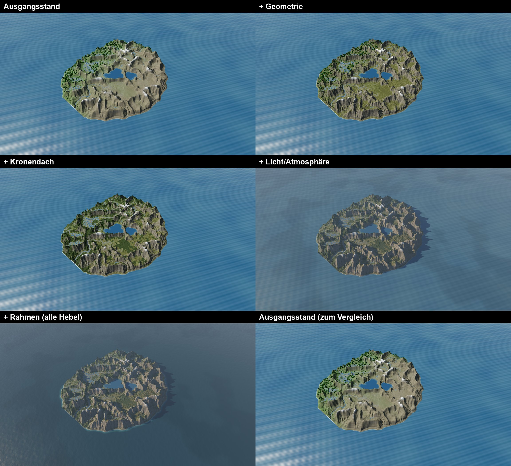
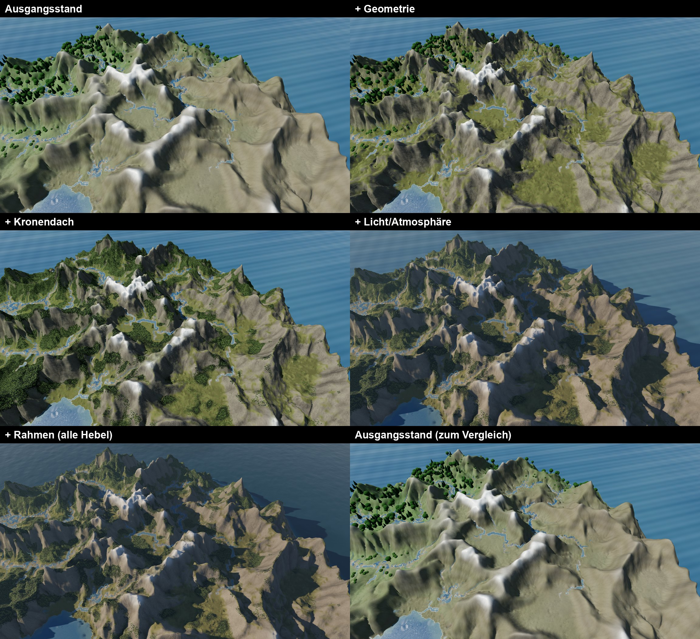
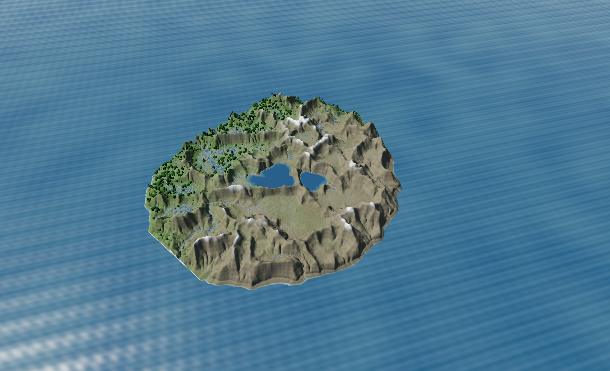
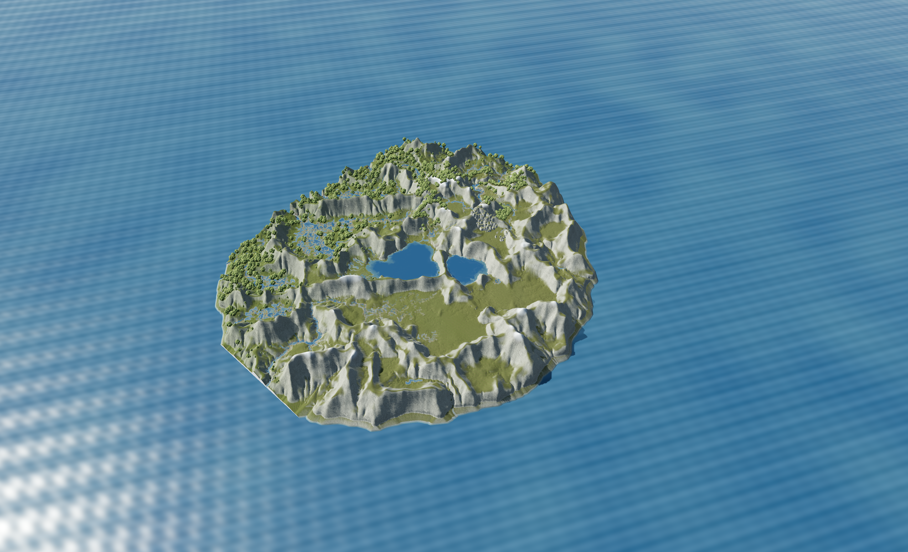
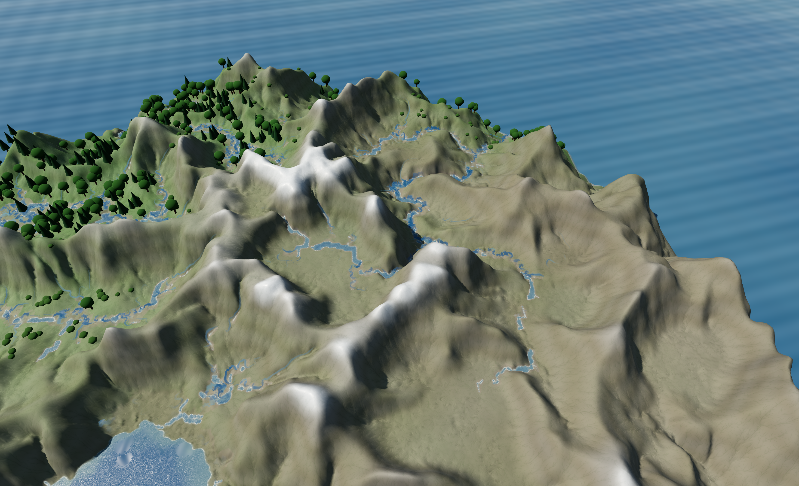
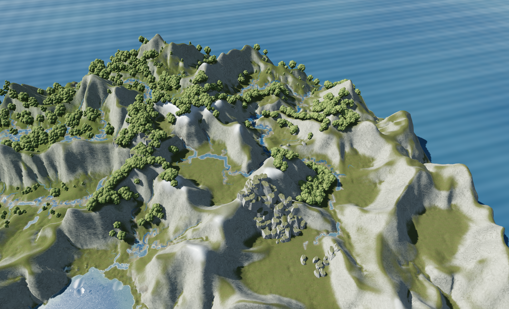
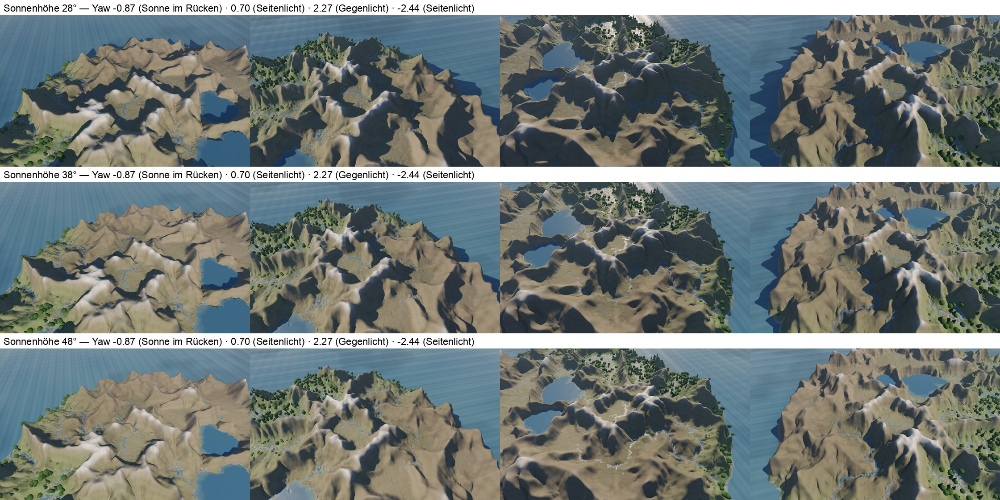
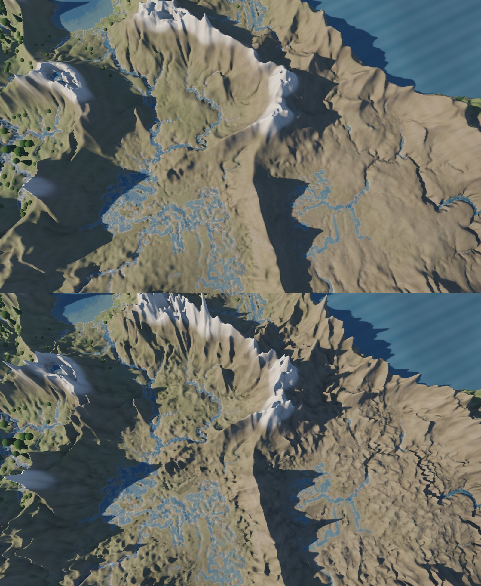

# Landschaftsqualität: Flusstal-Studie #116

Stand: 8. Oktober 2026, zweite Runde. Ausführbarer Prototyp, visuelle Abnahme
noch offen. Teil 2, Issue #117, beginnt erst nach ausdrücklicher Bestätigung
des Bildsprungs.

## Abgestimmtes Ziel

Der Projekteigner hat ein felsiges, dramatisches Tal nach dem Vorbild der Soča
gewählt. Helle gebrochene Felsflächen sollen sich von dunkleren Waldgruppen
absetzen, der Fluss muss auch aus der normalen Übersicht lesbar sein. Das ist
eine Bildstudie auf einer unveränderten Simulationswelt.

Zielmaschine ist der Apple M4 Max mit 40 GPU-Kernen und 64 GB RAM. Verbindlich
sind **3456×2104 Viewport-Pixel im maximierten Fenster** (internes Display,
Panel 3456×2234 abzüglich Fensterrahmen und Menüleiste), bei höchstens
**33,3 ms pro gerendertem Frame**.

## Warum eine zweite Runde

Die erste Runde (Commits bis `6c62e26`) tauschte im Wesentlichen die
Oberflächenfarbe: zwei PBR-Texturen, mehrteilige Kronen, handgesetzte Wald- und
Felsgruppen, etwas seitlicheres Licht. Der Projekteigner fand die Richtung gut,
den Unterschied aber zu klein. Die Analyse der A/B-Bilder ergab drei Ursachen,
die alle außerhalb der Oberflächenfarbe liegen:

1. **Form.** Das Mesh verschob ein 384er-Gitter (`balanced`) bilinear aus dem
   720er-Sim-Raster. Das feine Erosionsdetail wirkte nur auf Normalen, warf
   weder Silhouette noch Schatten und blendete ab ~120 Einheiten Abstand aus,
   in der Übersicht also fast ganz. Die Berge sahen aus wie Knete.
2. **Maßstab.** Eine Baumkrone war ~1 Einheit breit, das sind 7 Sim-Zellen oder
   bei einem Alpenrelief rund 90 m. Zusammen mit dem gestreiften Ozean las sich
   die Insel als Modell auf einem Tisch.
3. **Licht.** Hohe Sonne, kaum Luftperspektive, wenig Hell-Dunkel-Struktur.

Die zweite Runde setzt genau dort an, mit vier einzeln schaltbaren Hebeln.
Alle sind prozedural aus den Sim-Feldern abgeleitet. Die Handplatzierung der
ersten Runde ist entfallen, deshalb gilt die Studie für jeden Seed und bleibt
im Zeitraffer, nach Pinselstrichen und nach dem Laden aktiv.

## Die vier Hebel

`RS_STUDY_LEVERS` (Komma-Liste, Standard: alle) schaltete sie für die
Wirkungsleiter einzeln. Seit #152 sind alle vier Produktion; die Studie hat
keinen Hebel mehr, ein gesetztes `RS_STUDY_LEVERS` bricht ab.

| Hebel | Was er tut | Wo |
| --- | --- | --- |
| `geometry` | Render-Gitter in Sim-Auflösung (720 statt 384). Grobe Erosionsrinnen (dieselbe runevision-Funktion wie das feine Detail, Skala 0.022 UV ≈ 2,5 km Wellenlänge) und einseitig geschärfte Grate als **echte Verschiebung**. Einmal je Terrain-Update in eine 1440²-Float-Textur gebacken; der Vertex-Shader liest die Höhe, der Fragment-Shader Steigung und Rinnen-Schattierung. **Seit #153 Produktion** (s. [Render-Verschiebung](#render-verschiebung-von-rinnen-und-graten-in-der-anwendung-153)); die Studie hat den Schalter nicht mehr. | `game/shaders/relief_bake.gdshader`, `game/shaders/terrain.gdshader` |
| `canopy` | Weltmaßstab 1 Einheit ≈ 100 m. Wald als **Kronendach im Terrain-Shader**: ~20 m angehobenes Volumen (Waldkanten werfen Schatten), Voronoi-Kronen von ~11 m (Laubbaum als Kuppel, Nadelbaum als Kegel, Anteil nach Höhenband), dunkle Lücken, Selbstschatten zum Kronenrand. Lichtungen aus Rauschen, kein Wald in Wänden, auf Schnee oder an Wasser. Ersetzt die Instanzbäume. **Seit #152 Produktion** (s. [Kronendach](#kronendach-in-der-anwendung-152)); die Studie hat den Schalter nicht mehr. | `game/shaders/terrain.gdshader`, `SimRender.ForestCanopyMask` |
| `light` | Seitenlicht von links quer zur Studienkamera (Azimut −50°, Höhe 28°, warm), 8192er-Schattenatlas mit vier Kaskaden, AgX-Tonemapping, Luftperspektive (exponentieller Nebel mit Himmelsanteil), Talnebel über dem Meer, Wolkenschatten über Land, Bändern und Meer, ein Drittel neutral-warmes Umgebungslicht gegen blaue Schattenseiten. **Seit #151 Produktion** (Sonnenhöhe dort 38°, s. [Licht und Atmosphäre](#licht-und-atmosphäre-in-der-anwendung-151)); die Studie hat den Schalter nicht mehr. | `game/scripts/Lighting.gd`, `game/shaders/clouds.gdshaderinc` |
| `frame` | Ozean ohne Streifenmuster: Rausch-Wellen, die mit ihrer Pixelgröße ausblenden, statt drei Sinuswellen. Farbe aus der echten Wassertiefe über dem Sim-Schelf (türkis → tiefblau), gebrochener Brandungssaum. **Seit #155 Produktion** (s. u.), kein Studien-Schalter mehr. | `shaders/ocean.gdshader` |

Außerdem ist der Kalkstein der ersten Runde dunkler und strukturierter: er lag
mit ~0,5–0,6 Albedo bei Schneeweiß und las sich unter Himmelslicht als Schnee.
Jetzt zwei Texturskalen und Verwitterungsstreifen in Fallrichtung
(`materials.gdshaderinc`).

**Wasser bleibt unangetastet.** Verschiebung und Kronendach enden an einer
Schutzmaske: godot-freie Render-Ableitung in `SimRender`
(`WaterProtectMask`, Issue #154) aus dem zuletzt ausgelieferten Rasterwasser
plus der tatsächlichen Abdeckung der Flussbänder (der Raster-Deckel entfernt
Wasser unter Bändern), um einen Saum von `WaterRender.protectSeamCells` (2)
Zellen ausgedehnt. Der Saum steckt vollständig in der Maske; der Shader
(`game/shaders/protect.gdshaderinc`) filtert sie nur linear, die Kante wird also über eine
Zelle weich. Vor #154 entstand derselbe Saum von etwa zwei Zellen über eine
Mip-Stufe im Shader. Die Gratschärfung hebt nur, senkt nie: kein Talboden sinkt
unter ein Band. Seen hebt der Vertex-Shader wie bisher auf den Spiegel, dort
gibt es keine Verschiebung. Die Bänder sampeln die sichtbare Oberfläche des
vollen Sim-Gitters (`setRenderGrid(N)`). Die Sim-Felder ändern sich nicht.

**Produktion bleibt unverändert.** Alle Studien-Hooks in `terrain.gdshader`,
`ocean.gdshader` und `water.gdshader` stehen hinter `#ifdef FLUSSTAL_STUDY`;
`Flusstal.gd` stellt das Define zur Laufzeit vor die Quelle. Einzige
Strukturänderung am Produktions-Shader: der runevision-Filter liegt jetzt in
`game/shaders/erosion_filter.gdshaderinc` (gleicher Code, Skala als Parameter),
damit der Back-Pass ihn mitbenutzt statt ihn zu kopieren. `NOTICE` führt die
Datei als MPL-2.0.

## Bildvergleich

Wirkungsleiter, jeweils kumulativ (Ausgangsstand → + Geometrie → +
Kronendach → + Licht/Atmosphäre → + Rahmen):





| Ausgangsstand | Prototyp, alle Hebel |
| --- | --- |
|  |  |
|  |  |

Verworfene Zwischenstände dieser Runde:

- **1440er-Render-Gitter.** Gleiche Bildwirkung wie 720, sobald Normalen und
  Rinnen aus der Backtextur kommen, aber doppelte Framezeit (s. Leistung).
- **Filter pro Vertex statt gebacken.** Tiefen-Vorpass, Farbpass und vier
  Schattenkaskaden werteten ihn je erneut aus: 35,6 ms je Bild.
- **Gegenlicht (Azimut −130°).** Dramatischer, mit Glanz auf dem Meer, legte
  aber alle der Kamera zugewandten Wände in den Schatten; dort verschwand das
  Relief.
- **Breite Schutzmaske** (Mip 3,5, Faktor 6): sperrte ganze Talböden für
  Verschiebung und Wald.

## Reproduktion

Ausgangscommit (main): `e56fb18074e6faed0c3eb5a600a4188dfabdbe06`, der Branch
ist darauf rebased. Godot 4.7.2 (Steam-Build, Metal Forward+); CI pinnt dieselbe
Version über `scripts/fetch-godot.sh`. Extension lokal mit
`scripts/build.sh release` gebaut, Build-Stempel geprüft.

`scripts/graphics-study.sh` legt Seed 1337, 20.000 Vorlaufjahre in Schritten von
1000 Jahren und `balanced` fest. Beide Varianten starten eine neue,
deterministisch identische Welt.

| Kamera | Ziel X/Z | Distanz | Yaw | Pitch |
| --- | --- | ---: | ---: | ---: |
| `overview` | 0 / 0 | 151.846515 | 0.7 | 0.85 |
| `detail` | -12 / -25 | 42 | 0.7 | 0.85 |

```sh
export GODOT=/pfad/Godot.app/Contents/MacOS/Godot
scripts/build-stamp.sh --check
"$GODOT" --headless --path game --import
scripts/graphics-study.sh prototype detail interactive
scripts/graphics-study.sh baseline detail interactive

# Der letzte Parameter ist ein absoluter Ausgabepfad ohne .png.
scripts/graphics-study.sh baseline overview shot /tmp/baseline-overview
scripts/graphics-study.sh prototype overview shot /tmp/prototype-overview

# Getrennte Echtzeitmessungen, immer maximiert.
scripts/graphics-study.sh prototype overview still /tmp/still
scripts/graphics-study.sh prototype overview orbit /tmp/orbit
scripts/graphics-study.sh prototype overview simulation /tmp/simulation
```

Weitere Schalter, alle in `Flusstal.gd`:
`RS_STUDY_DEBUG=protect|forest|cavity`
(Schutzmaske, Waldmaske, Rinnen/Rippen als Falschfarbe). `RS_STUDY_GRID` und
`RS_STUDY_RELIEF` sind mit #153 entfallen: das Render-Gitter misst man über
`RS_RENDER_GRID`, die Kalibrierung steht in `SimCore.ReliefRender`. Ein unbekannter
Hebelname bricht wie eine ungültige Variante mit Fehler ab.

`shot` friert die Wasser-Animationsphase ein und speichert nach 60 gerenderten
Bildern. Ein normal gestartetes Spiel aktiviert die Studie nicht.

## Bewegung

Bewegungsaufnahmen mit Godots MovieWriter bei festen 30 Bildern pro Sekunde,
maximiert. Reproduzierbare Bewegungsbelege, keine FPS-Messungen.

```sh
RS_STUDY_MOVIE=/tmp/prototype-orbit.avi \
  scripts/graphics-study.sh prototype detail orbit /tmp/prototype-orbit
ffmpeg -i /tmp/prototype-orbit.avi -c:v libx264 -preset fast -crf 22 \
  -maxrate 20M -bufsize 40M -pix_fmt yuv420p \
  -an -movflags +faststart /tmp/prototype-orbit.mp4
```

| Aufnahme, jeweils 12 Sekunden bei 3456×2104 | Baseline | Prototyp |
| --- | --- | --- |
| Kamerafahrt im Ausschnitt | [MP4](screenshots/graphics-quality/baseline-orbit.mp4) | [MP4](screenshots/graphics-quality/prototype-orbit.mp4) |
| Simulationsfortschritt im Ausschnitt | [MP4](screenshots/graphics-quality/baseline-simulation.mp4) | [MP4](screenshots/graphics-quality/prototype-simulation.mp4) |

Die Kamerafahrt beginnt nach zwei Sekunden und dreht mit 0,08 rad/s. Im
Zeitraffer läuft stattdessen die Simulation mit 60 Jahren/s. Anders als in der
ersten Runde bleibt der Prototyp im Zeitraffer vollständig: Verschiebung,
Schutzmaske und Kronendach folgen jedem Terrain-Update. Die Encoderauflösung
legen die `movie`-Viewport-Einträge in `project.godot` fest (der MovieWriter
öffnet den Encoder vor dem Maximieren und ignoriert `--resolution` dafür).

## Leistung

`STUDY_TIMING` misst Intervalle zwischen tatsächlichen `frame_post_draw`-
Signalen, nach zwei Sekunden Einlauf für weitere zehn Sekunden, VSync und
FPS-Deckel aus, Renderloop auch bei stehender Kamera an. Mittelwert und
Perzentile sind Frameintervalle einschließlich CPU-Arbeit, keine
GPU-Zeitstempel.

Normale Übersicht, je ein sequenzieller Lauf ohne parallele Last, 8. Oktober
2026. Millisekunden; Rohdaten in
[measurements.json](screenshots/graphics-quality/measurements.json).

| Variante / Betrieb | Mittel | p95 | p99 | Maximum | Frames über 33,3 ms |
| --- | ---: | ---: | ---: | ---: | ---: |
| Baseline, Standbild | 8,73 | 9,12 | 9,39 | 10,49 | 0 / 1147 |
| Prototyp, Standbild | 16,52 | 17,16 | 17,44 | 17,93 | 0 / 607 |
| Baseline, Kamerafahrt | 8,70 | 9,12 | 9,29 | 9,83 | 0 / 1150 |
| Prototyp, Kamerafahrt | 19,40 | 21,05 | 21,42 | 23,02 | 0 / 517 |
| Baseline, Zeitraffer | 10,96 | 11,21 | 70,08 | 79,35 | 39 / 913 |
| Prototyp, Zeitraffer | 22,11 | 51,86 | 98,49 | 105,90 | 38 / 453 |

Standbild und Kamerafahrt bleiben vollständig unter dem Budget, mit rund 40 %
Reserve. Der Zeitraffer überschreitet es in beiden Varianten bei derselben
Zahl von Frames (38 bzw. 39, die Simulationsschritte). Beim Prototyp sind diese
Spitzen höher, und weil insgesamt weniger Frames entstehen, ist ihr Anteil
doppelt so groß (p95 51,9 statt 11,2 ms). Ein durchgehend eingehaltenes
33,3-ms-Budget ist im Zeitraffer damit **nicht** nachgewiesen, in keiner
Variante.

Woher die Mehrkosten kommen (gemessen):

| Messung | ms/Bild, Standbild |
| --- | ---: |
| Render-Gitter 720 / 1080 / 1440, alle Hebel | 16,1 / 23,7 / 32,3 |
| Filter pro Vertex statt gebacken, 1440er-Gitter | 35,6 |
| nur `canopy` / nur `light` / nur `frame` (384er-Gitter; `frame` seit #155 nicht mehr schaltbar, Wert historisch) | 10,0 / 10,7 / 11,7 |

Die Kosten folgen der Vertexzahl. Die Hebel `canopy`, `light` und `frame` sind
im Vergleich billig.

Bis Issue #154 rasterte die Studie je Fluss-Rebuild jedes Band-Dreieck in
GDScript (~20 ms), seitdem kommt die Schutzmaske fertig aus `SimRender`.
Gemessen im Zeitraffer wie oben (Übersicht, Prototyp, maximiert,
Viewport 3456×2104, M4 Max, 9. Oktober 2026), je zwei Läufe abwechselnd mit
eigenem Build:

| Stand | Mittel | p95 | p99 | Maximum | Frames über 33,3 ms |
| --- | ---: | ---: | ---: | ---: | ---: |
| vor #154 (`main` d5e73e2) | 20,65 / 20,91 | 50,70 / 52,92 | 102,08 / 102,46 | 113,08 / 110,59 | 39 / 485, 39 / 478 |
| mit #154 | 20,25 / 20,35 | 52,63 / 51,64 | 78,70 / 75,80 | 84,10 / 82,82 | 40 / 494, 39 / 492 |

Die höchsten Spitzen, also die Ticks mit Fluss-Rebuild, fallen um rund 28 ms.
Die Zahl der Frames über dem Budget bleibt: das sind die Simulationsschritte
selbst (s. o.), nicht die Maske.

## Grenzen dieser Studie

- Die Verschiebung ist kosmetisch und nicht Teil der Sim-Höhe: Pinsel-Picking,
  Baum-Instanzen (hier ausgeschaltet) und alles, was `heightsBytes()` liest,
  sehen die glatte Sim-Fläche. Gemessen reicht der Zuschlag von −0,25 bis
  +1,0 Einheiten (Grate), meist deutlich weniger.
- Das Kronendach ist eine Oberfläche, keine Geometrie. Bei sehr flachem Blick
  fehlt ihm die Parallaxe einzelner Bäume. Für Nahsicht bräuchte #117
  zusätzlich echte Instanzen an Waldrändern.
- Wolkenschatten wirken als Albedo-Faktor und dunkeln damit auch etwas
  Umgebungslicht ab.
- Die Lichtstimmung war auf die Studienkamera abgestimmt. Die kamera-
  unabhängige Wahl für die Anwendung hat #151 getroffen (feste Welt-Sonne,
  s. u.).
- Großräumige Geländeformen ändert die Studie nicht. Die Frage aus #116, ob sie
  den Realismus begrenzen, beantwortet die Leiter teilweise: die gerenderte
  Verfeinerung trägt bereits den größten Einzelschritt.

## Assets und Lizenzen

Die sechs 1K-JPEGs liegen unverändert unter `game/studies/flusstal/assets/`.
Nach einem Klon ist kein Assetdienst erforderlich. `manifest.json` enthält die
Original-Downloadadressen, die vom Anbieter gelieferten MD5-Werte und
SHA-256-Prüfsummen der eingecheckten Dateien.

| Asset | Urheber | Nutzung |
| --- | --- | --- |
| [Rock Boulder Cracked](https://polyhaven.com/a/rock_boulder_cracked) | Dario Barresi, Dimitrios Savva | Farbe, OpenGL-Normale, Rauheit; Entsättigung im Shader |
| [Forest Ground 01](https://polyhaven.com/a/forrest_ground_01) | Rob Tuytel | Farbe, OpenGL-Normale, Rauheit |

Beide stehen unter [CC0](https://polyhaven.com/license); die freiwillige
Nennung steht hier. Kronen, Wolken, Ozean und Verschiebung sind vollständig
prozedural. Die Referenzfotos der Bildrichtung (Soča-Luftbild,
[soca-valley.com](https://www.soca-valley.com/en/accommodation/); Große
Soča-Schlucht, [pristava-lepena.com](https://pristava-lepena.com/en/attraction/velika-korita);
Isar im Vorkarwendel, [LBV](https://bad-toelz.lbv.de/unsere-arbeit/gebietsbetreuung-moore-und-isar/projektgebiet-isar/))
sind nur verlinkt, keine Spielassets.

## Verifikation und Übergabe

- `graphics_study.gd` (CI-Marke `GRAPHICS_STUDY_OK`) prüft: die Schutzmaske
  kommt über Brücke und Studie als R8 in Gittergröße an, sperrt voll
  sichtbares Wasser, lässt trockenes Land frei und verändert das
  Render-Wasserfeld nicht (Inhalt im Einzelnen: `WaterProtectMaskTests`);
  die Hebel-Liste schaltet einzeln und ein Tippfehler bricht ab; die
  Studien-Fassungen von Terrain-, Ozean- und Band-Shader kompilieren und
  liefern ihre Uniforms, die Produktionsfassungen kennen sie nicht; der
  Back-Pass kompiliert.
- Lokal grün (8. Oktober 2026, macOS): SimCore-Pflichtsuite (392 Tests, 32
  übersprungene Messläufe, 0 Fehler), `smoke.gd`, `water_uniforms.gd`,
  `water_geometry.gd`, `river_ribbons.gd`, `graphics_study.gd`.
- Merge-Gate bleiben `test` und `godot-contract` in CI.
- Die visuelle Bestätigung des Projekteigners steht noch aus.

Für #117 übertragbar: Verschiebung als gebackene Render-Ableitung (gehört nach
SimRender oder als GPU-Pass in die Brücke), Kronendach statt Einzelbäumen in
der Übersicht, Schutzmaske aus Wasserfeld und Bändern, Ozean nach Wassertiefe.
Offen: Instanzbäume an Waldrändern für Nahsicht,
Kosten der Maske im Zeitraffer, Detailstufen jenseits eines festen 720er-Gitters.

## Übernahme in die Produktion

### Ozean (#155, Hebel `frame`)

Der Hebel `frame` ist die normale Darstellung des offenen Meers
(`game/shaders/ocean.gdshader`); `ocean.gdshaderinc` und der Schalter
`study_ocean` sind entfallen, die Studie zeigt den neuen Ozean damit in beiden
Varianten. Die Studien-Zahlen stehen jetzt als `WaterRender.ocean*` im
Kalibrier-Vertrag und reisen als `water_ocean_*`-Uniforms über denselben
Brücken-Weg wie die übrige Wasser-Optik (`SimRender.WaterUniforms`). Wächter:
`WaterUniformsTests` (Spiegel, default-freie Deklarationen),
`WaterRenderTests` (Tiefen-Rampe, Brandungs- und Ausblende-Fenster, kein
`sin`/`cos` im Ozean-Shader) und End-to-End `game/tests/water_uniforms.gd`.

Gegenüber der Studie geändert: das Rauschen ist das `noise2` des
Ozean-Shaders statt des Wolken-Rauschens (gleiche Bauform, andere
Hash-Konstanten), außerhalb des Sim-Quadrats gilt volle Tiefe über denselben
Ausdruck wie innen. Fresnel, Himmels-Spiegelung, Rauheit und Glanz bleiben die
gemeinsame Optik aller drei Wasser-Shader; Seicht/Tief-Farbe und
Strömungs-Schimmer des Binnenwassers liest das Meer nicht mehr.

Abnahme (9. Oktober 2026, M4 Max, maximiert 3456×2104, `balanced`, Variante
`baseline`, Jahr 20.000): Übersicht und Küste je Seed 1337/42/20 aus der
Matrix, vorher/nachher im selben Build (nur `ocean.gdshader` getauscht, die
Brücke liefert beide Uniform-Sätze). Vorher in jeder Übersicht das
Streifenmuster bis zum Horizont, nachher keines; die Küste zeigt einen
türkisen Schelf mit gebrochenem Brandungssaum. `graphics-matrix.sh` braucht
Bash 4 (`declare -A`) und läuft mit dem macOS-Bash 3.2 nicht; die Bilder
entstanden mit denselben Umgebungsvariablen von Hand.

Framezeiten, Übersicht Seed 1337, je vier Läufe interleaved A/B. Parallel lief
eine zweite Godot-Instanz aus einem anderen Worktree auf derselben GPU; die
Ausreißer treffen beide Varianten und sind deshalb kein Ozean-Effekt:

| Messung (ms) | vorher Mittel / p95 | nachher Mittel / p95 |
| --- | --- | --- |
| Standbild | 9,3–10,1 / 10,3–16,0 | 10,8–11,8 / 16,6–28,9 |
| Kamerafahrt | 9,9–12,1 / 20,8–26,6 | 9,6–11,1 / 10,1–20,2 |

Der neue Ozean kostet im Standbild gut 1 ms im Mittel (vier Rausch-Oktaven
mit je drei Abfragen je Pixel). Das Mittel bleibt in allen Läufen weit unter
33,3 ms. Einzelne Bilder über Budget gab es in beiden Varianten, nur unter der
Fremdlast. Eine Messung ohne Fremdlast steht noch aus.

## Abnahmematrix für Folge-Tickets (#150, Spec #156, Parent #117)

Als verbindliche Arbeits- und Vergleichsgrundlage für alle nachfolgenden Tickets
von #117 („Landschaftsqualität") dient eine standardisierte Matrix aus drei
Seeds, drei Entwicklungsstadien und sechs Kameraperspektiven (insgesamt 54
Einzelansichten je Variante). Jedes Folge-Ticket erbringt seine Vorher/Nachher-Bilder
und Leistungsmessungen reproduzierbar gegen diese Matrix.

### Auswahl der Seeds und Begründung

Die drei Seeds wurden so gewählt, dass sie in Kombination das gesamte Spektrum
der in Flusslandschaften relevanten Geomorphologie und Biome abdecken:

1. **Seed 1337 („Flusstal Soča", Referenzwelt aus #116):**
   - *Charakter:* Felsiges Kerbtal mit tief eingeschnittenem Hauptfluss,
     dendritischem Zuflussnetz, starkem Relief (~4,4 m) und Meeresmündung.
   - *Fokus:* Bewaldete Talböden, steile Felswände, Fluss- und Auenstrukturen,
     Schluchtgeometrie und Mündungsdelta ins offene Meer.
2. **Seed 42 („Seen- und Beckenplateau"):**
   - *Charakter:* Ausgeprägte Binnenbecken- und Seenlandschaft (dokumentiert in
     `docs/nickmcd-behavior-verification.md` und `docs/endorheic-evaporation-measurements.md`).
   - *Fokus:* Große stehende Gewässer, dynamische Seespiegel und Auslass-Inzision,
     Verlandungszonen, Strand- und Uferlinien, Flachlandflüsse ohne extreme Steilwände,
     niedrige Schneegrenzen-Aktivität.
3. **Seed 20 („Hochalpines Massiv"):**
   - *Charakter:* Hochgebirge mit maximalem Relief (Spitzenhöhe 16,7 m, robustes
     Relief 4,9 m) und stärkstem Kaltklima (dokumentiert in `docs/melt-runoff-measurements.md` §A).
   - *Fokus:* Großflächige ganzjährige Firn- und Schneefelder (über 4400 Zellen im
     Frühstadium), scharfe kahle Felsgrate, Karenbecken, Moränen und eiszeitliche
     Trogtäler, Übergang von spärlicher alpiner Vegetation zu ewigem Schnee.

### Entwicklungsstadien (Jahre)

Jeder Seed wird in drei definierten Zeitschritten abgenommen:

- **Jahr 0 (nach Einlauf):** Zustand direkt nach Abschluss der 3000
  Einlaufjahre (`SimConfig.productionSettleYears`). Zeigt das tektonisch frische,
  ungealterte Relief mit steilen Bruchkanten, initialem Flussnetz und beginnender
  Pflanzensukzession.
- **Jahr 20.000 (mittlere Reife):** Ausgewogenes Stadium mit voll ausgebildeter
  Erosionsmorphologie, tief eingeschnittenen Haupttälern, stabilen Flussbetten
  und reifem Vegetationssaum. Entspricht dem Referenzstadium der Flusstal-Studie.
- **Jahr 100.000 (Altersstadium):** Gealterte Landschaft nach post-orogenem
  Zerfall (`upliftDecay`). Grate durch lineare Hangdiffusion gerundet, Talböden
  verbreitert, weitreichende Mäander- und Zopfstromsysteme, maximal dichter
  Baumbestand durch langjährige Sukzession.

### Kameraperspektiven je Welt

Um optische Mängel nicht hinter gefälligen Schönansichten zu verbergen, umfasst
jede Welt neben Übersicht und Nahansicht vier gezielte Stresstests:

| Kamera-ID | Typ | Parameter (Target X/Z, Dist, Yaw, Pitch) | Prüfzweck / Stresstest |
| :--- | :--- | :--- | :--- |
| `overview` | Übersicht | `(0, 0)`, Dist 151.85, Yaw 0.70, Pitch 0.85 | Gesamtsilhouette der Insel, Großrelief, Maßstabslesbarkeit gegen Ozean und Himmel. |
| `detail` | Nahansicht | Seed 1337: `(-12, -25)`, Dist 42, Yaw 0.70, Pitch 0.85<br>Seed 42: `(4, -6)`, Dist 45, Yaw 0.50, Pitch 0.80<br>Seed 20: `(-8, 10)`, Dist 42, Yaw 0.60, Pitch 0.80 | Charakteristisches Hauptmerkmal: Talsohle, Seebucht oder Karenbecken; Kronendach und Felsstrukturen. |
| `grazing` | Flacher Blick | Seed 1337: `(-10, -20)`, Dist 38, Yaw 0.70, Pitch 1.35<br>Seed 42: `(6, -4)`, Dist 40, Yaw 0.40, Pitch 1.35<br>Seed 20: `(-6, 12)`, Dist 38, Yaw 0.50, Pitch 1.35 | **Stresstest Parallaxe:** Pitch 1.35 (~13° über Horizont). Deckt Flachheit von Kronendach, fehlende Baum-Parallaxe und Texturstreckung an Hangflanken auf. |
| `backlight` | Gegenlicht | Seed 1337: `(-12, -25)`, Dist 45, Yaw 2.269, Pitch 0.85<br>Seed 42: `(4, -6)`, Dist 48, Yaw 2.269, Pitch 0.85<br>Seed 20: `(-8, 10)`, Dist 46, Yaw 2.269, Pitch 0.85<br>*(feste Welt-Sonne Azimut -50°; Yaw = Azimut + 180°)* | **Stresstest Beleuchtung:** Blick direkt gegen die Sonne. Alle kamerazugewandten Flanken liegen im Eigenschatten; prüft Relieflesbarkeit im Schatten, Tonemapping und Streulicht. |
| `coast` | Küste / Ufer | Seed 1337: `(-36, -32)`, Dist 45, Yaw 0.90, Pitch 0.85<br>Seed 42: `(12, -10)`, Dist 38, Yaw 1.10, Pitch 0.85<br>Seed 20: `(30, -28)`, Dist 48, Yaw 0.80, Pitch 0.85 | **Stresstest Wasser-Land:** Mündungsdelta, Binnensee-Ufer oder Steilküste. Prüft Schutzmaske, Übergang von Flussband zu Ozean/See, Brandung und Tiefenfarbe. |
| `snow` | Schnee / Grate | Seed 1337: `(18, 14)`, Dist 48, Yaw 0.60, Pitch 0.75<br>Seed 42: `(-22, 20)`, Dist 50, Yaw 0.70, Pitch 0.75<br>Seed 20: `(-10, 14)`, Dist 40, Yaw 0.60, Pitch 0.70 | **Stresstest Schneegrenze:** Felsrippen, Firnfelder und Gipfel. Prüft Gratschärfung, Schnee-Albedo und Übergang von Wald/Fels zu Schnee. |

### Physikalische Baseline-Kennzahlen der Matrixwelten

Gemessen mit dem headless SimCore-Harness (`GraphicsMatrixTests.testMatrixBaselineMetricsDiagnostic()`,
Produktions-Grid $n = 720$, 112,48 m Weltbreite, $HSCALE = 24.0$):

| Seed | Name | Stadium | max_y | Relief (p95-med) | See-Zellen | Ozean-Zellen | Schnee-Zellen | Wald-Zellen | Kanal-Knoten |
| ---: | :--- | :--- | ---: | ---: | ---: | ---: | ---: | ---: | ---: |
| 1337 | Flusstal Soča | Jahr 0 (Einlauf) | 16,28 m | 4,42 m | 29.587 | 159.754 | 4.233 | 197.057 | 17.465 |
| 1337 | Flusstal Soča | Jahr 20k | 14,41 m | 4,07 m | 26.780 | 158.237 | 2.722 | 240.319 | 22.779 |
| 1337 | Flusstal Soča | Jahr 100k | 13,89 m | 3,08 m | 31.079 | 157.412 | 793 | 287.707 | 27.426 |
| 42 | Seen- und Beckenplateau | Jahr 0 (Einlauf) | 14,71 m | 4,12 m | 3.606 | 369.113 | 288 | 125.982 | 7.532 |
| 42 | Seen- und Beckenplateau | Jahr 20k | 13,80 m | 3,93 m | 1.183 | 369.046 | 123 | 133.792 | 9.146 |
| 42 | Seen- und Beckenplateau | Jahr 100k | 13,35 m | 3,06 m | 224 | 370.325 | 0 | 135.434 | 11.201 |
| 20 | Hochalpines Massiv | Jahr 0 (Einlauf) | 16,67 m | 4,89 m | 18.533 | 260.497 | 4.410 | 158.644 | 13.343 |
| 20 | Hochalpines Massiv | Jahr 20k | 14,38 m | 4,63 m | 11.188 | 259.669 | 3.311 | 189.860 | 16.184 |
| 20 | Hochalpines Massiv | Jahr 100k | 13,86 m | 3,41 m | 173 | 260.287 | 1.430 | 220.397 | 19.511 |

*Befund der Physik:*
- Der post-orogene Zerfall senkt das Relief über 100.000 Jahre messbar von ~4,4–4,9 m
  auf ~3,1–3,4 m.
- Die Sukzession lässt das Waldfeld kontinuierlich anwachsen (Seed 1337 von 197k auf
  288k Zellen).
- Das hydrographische Netzwerk verzweigt sich stetig (Kanal-Knoten steigen auf allen
  Seeds um 40–60 %).
- Auf Seed 20 bleibt selbst nach 100k Jahren ein substanzielles Schneefeld (1.430
  Zellen) erhalten, während Seed 42 weitgehend schneefrei altert.

### Ausführung und Reproduktion

Das Skript `scripts/graphics-matrix.sh` automatisiert den vollständigen Durchlauf:

```sh
# 1. Alle 54 Aufnahmen für eine Variante erzeugen:
scripts/graphics-matrix.sh baseline docs/screenshots/graphics-matrix/baseline shot
scripts/graphics-matrix.sh prototype docs/screenshots/graphics-matrix/prototype shot

# 2. Übersicht aller Permutationen auflisten:
scripts/graphics-matrix.sh baseline "" list

# 3. Einzelne Welten oder Kameras filtern:
RS_MATRIX_SEED=1337 RS_MATRIX_YEAR=20000 scripts/graphics-matrix.sh baseline docs/screenshots/graphics-matrix/baseline shot

# 4. Leistungsmessungen (Standbild, Kamerafahrt, Zeitraffer) je Welt durchführen:
scripts/graphics-matrix.sh baseline docs/screenshots/graphics-matrix/baseline timing
```

### Baseline-Bilder und Messungen (Status)

- **Vorhandene Baseline-Bilder:** Die M4-Max-Originalaufnahmen aus `main` für die Referenzwelt
  liegen unter `docs/screenshots/graphics-quality/` vor und entsprechen den Matrix-Kameras:
  - `baseline-overview.png` (entspricht `seed1337_20k_overview.png`)
  - `baseline-detail.png` (entspricht `seed1337_20k_detail.png`)
  (Keine redundanten Binärduplikate im Repo; `scripts/graphics-matrix.sh` exportiert den
  vollständigen 54-Bilder-Satz).
- **Baseline-Messwerte der Referenzwelt (M4 Max, 3456×2104, Seed 1337, Jahr 20k):**
  - Standbild: Mittel 8,73 ms, p95 9,12 ms, p99 9,39 ms, Max 10,49 ms (0 Überschreitungen / 1147 Frames)
  - Kamerafahrt: Mittel 8,70 ms, p95 9,12 ms, p99 9,29 ms, Max 9,83 ms (0 Überschreitungen / 1150 Frames)
  - Zeitraffer: Mittel 10,96 ms, p95 11,21 ms, p99 70,08 ms, Max 79,35 ms (39 Überschreitungen / 913 Frames)
- **Offener Punkt:** Die Ausführung der verbleibenden Matrixaufnahmen und
  Frameintervall-Messreihen im maximierten 3456×2104-Fenster erfordert Zugriff auf
  die Zielmaschine (Apple M4 Max). Der Ablauf ist über `scripts/graphics-matrix.sh`
  vollständig automatisiert und vorbereitet.

## Licht und Atmosphäre in der Anwendung (#151)

Stand 9. Oktober 2026. Der Hebel `light` der Studie ist die normale
Darstellung, für jede Welt und jede Kamerarichtung. Einzige Quelle ist
`game/scripts/Lighting.gd`: Sonne, Himmel, Umgebungslicht, AgX, Luftperspektive,
Talnebel, Schattenatlas und Wolkenschatten. Die Wolkenschatten sind eine
gemeinsame Funktion in `game/shaders/clouds.gdshaderinc`, eingebunden in
Terrain-, Band- und Ozean-Shader mit denselben Weltkoordinaten, damit sie ohne
Kante über Ufer und Küste laufen. Ihre Uniforms sind default-frei, die Werte
setzt nur `Lighting.gd`. Die Wasser-Optik reist unverändert über die Brücke
(`SimRender.WaterUniforms`); `Lighting.gd` setzt keine `water_*`-Uniform. Der
neue Himmel ändert nur, was das Wasser spiegelt. Wächter:
`game/tests/lighting.gd` (CI-Marke `LIGHTING_OK`), die Wasserverträge sind
unverändert grün.

### Feste Welt-Sonne

Entschieden am 8. Oktober 2026: eine feste Richtung. Azimut −50° hält die
Startkamera (Yaw 0.7) im Seitenlicht wie in der Studie. Die Höhe stammt aus
einem Vergleich von 28°, 38° und 48° auf Seed 1337, Jahr 20.000, Kamera
`detail` aus vier Richtungen: Sonne im Rücken (Yaw −0.87), Seitenlicht von
beiden Seiten (0.70 und −2.44) und Gegenlicht (2.27).



- **28°** (Wert der Studie): Im Gegenlicht liegt fast jede der Kamera
  zugewandte Flanke im Schatten, das Relief zerfällt in dunkle Flächen. Genau
  diese Schwäche hatte die Studie bei ihrer Gegenlicht-Variante beobachtet.
- **48°**: alle Richtungen hell, aber die Schatten werden kurz, und das
  Seitenlicht verliert die Modellierung der Grate.
- **38°, gewählt**: Das Gegenlicht bleibt lesbar (Flanken dunkel, aber nicht
  schwarz, Grate mit Lichtkante), im Seitenlicht werfen die Grate noch lange
  Schatten.

Belegt für alle Matrixwelten aus denselben vier Richtungen, je vorher und
nachher (Kamera `detail` je Seed, Jahr 0, 20.000 und 100.000). Das Relief
bleibt in allen Ansichten lesbar:

- [Seed 1337](screenshots/graphics-quality/light-directions-seed1337.jpg)
- [Seed 42](screenshots/graphics-quality/light-directions-seed42.jpg)
- [Seed 20](screenshots/graphics-quality/light-directions-seed20.jpg)

### Vergleichsmatrix vorher/nachher

Alle 54 Matrixansichten, je Seed ein Bogen (Zeilen: Jahr × vorher/nachher,
Spalten: die sechs Kameras):
[Seed 1337](screenshots/graphics-quality/light-matrix-seed1337.jpg),
[Seed 42](screenshots/graphics-quality/light-matrix-seed42.jpg),
[Seed 20](screenshots/graphics-quality/light-matrix-seed20.jpg).

Korrektur an der Matrix aus #150: Die Kamera `backlight` stand bei Yaw −0.87,
also auf dem Sonnenazimut. Damit stand die Sonne im Rücken, es war kein
Gegenlicht. Seit #151 gilt Yaw = Azimut + 180° = 2.269, und zwar in beiden
Spalten des Vergleichs. Die Vorher-Bilder entstanden auf
`e432f18` mit der korrigierten Matrix (dort hat die Studien-Variante `baseline`
noch das alte Licht). Reproduktion auf der Zielmaschine:

```sh
scripts/graphics-matrix.sh baseline /tmp/after shot
RS_MATRIX_CAMERA=detail RS_MATRIX_YAWS=-0.873,0.698,2.269,-2.443 \
  scripts/graphics-matrix.sh baseline /tmp/after-dirs shot
# vorher: dasselbe in einem Worktree auf e432f18 (graphics-matrix.sh von hier kopieren)
```

`graphics-matrix.sh` lief vorher auf macOS nicht (bash 3.2 kennt `declare -A`).
Es braucht jetzt keine assoziativen Arrays mehr. `RS_MATRIX_YAWS` rendert eine
Kamera aus mehreren Richtungen, `RS_MATRIX_QUALITY` legt die Qualitätsstufe der
Messläufe fest.

### Qualitätsstufen und Leistung

Was `performance` am Licht spart (`Lighting.QUALITY`): 4096er- statt 8192er-
Schattenatlas, zwei statt vier Kaskaden, keine Wolkenschatten; SSAO war dort
schon aus. `balanced` und `quality` tragen dasselbe Licht. `quality`
unterscheidet sich weiter nur im Render-Gitter, und dort dominiert die
Vertexzahl.

M4 Max, maximiert, Viewport 3456×2104, Seed 1337, Jahr 20.000, Kamera `detail`,
`scripts/graphics-matrix.sh … timing` (Flusstal-Szene, Variante `baseline` =
normale Darstellung). Ein sequenzieller Lauf je Zeile ohne parallele Last.
Millisekunden je Frame:

| Stufe | Betrieb | vorher Mittel / p95 / max | nachher Mittel / p95 / max | über 33,3 ms vorher → nachher |
| --- | --- | ---: | ---: | ---: |
| performance | Standbild | 4,09 / 4,07 / 12,03 | 4,69 / 4,73 / 12,31 | 0 → 0 |
| performance | Kamerafahrt | 4,17 / 4,21 / 9,18 | 4,80 / 4,93 / 8,83 | 0 → 0 |
| performance | Zeitraffer | 5,45 / 8,34 / 99,79 | 6,11 / 8,44 / 98,17 | 39 → 39 |
| balanced | Standbild | 13,16 / 13,42 / 13,60 | 16,27 / 17,76 / 18,06 | 0 → 0 |
| balanced | Kamerafahrt | 13,47 / 15,05 / 15,28 | 17,72 / 19,14 / 19,46 | 0 → 0 |
| balanced | Zeitraffer | 16,27 / 48,92 / 80,53 | 20,30 / 48,21 / 79,55 | 39 → 38 |
| quality | Standbild | 21,03 / 21,89 / 22,23 | 21,21 / 21,89 / 22,03 | 0 → 0 |
| quality | Kamerafahrt | 21,31 / 22,62 / 23,14 | 21,26 / 22,78 / 23,00 | 0 → 0 |
| quality | Zeitraffer | 23,08 / 50,84 / 77,18 | 23,00 / 50,08 / 78,23 | 38 → 40 |

Standbild und Kamerafahrt halten das Budget von 33,3 ms in jeder Stufe, auch
im schlechtesten Einzelframe. Das Licht kostet in `balanced` rund 3–4 ms, in
`performance` rund 0,6 ms. In `quality` ist der Unterschied nicht messbar, weil
dort das Render-Gitter die Framezeit bestimmt. Im Zeitraffer überschreiten wie
bisher nur die Sim-Schritte das Budget, gleich oft wie vorher (38–40 Frames je
Lauf). Das ist der bekannte Befund aus der Studie, das Licht erhöht weder ihre
Zahl noch ihre Höhe.

Begründung der `performance`-Einsparung: dieselbe Szene in `performance`,
Kamerafahrt, mit einzeln zurückgedrehten Sparmaßnahmen. Volle Studien-Schatten
mit Wolken 5,53 ms, nur die Wolken aus 5,23 ms, nur Atlas und Kaskaden reduziert
4,96 ms, beides reduziert (gewählt) 4,80 ms. Die Ersparnis von rund 0,7 ms
(~13 %) bleibt in der billigsten Stufe. Die Standbild-Werte dieser Reihe
streuten stärker (5,5–6,6 ms) und sind deshalb nicht aufgeführt.

## Render-Verschiebung von Rinnen und Graten in der Anwendung (#153)

Stand 10. Oktober 2026. Der Hebel `geometry` der Studie ist die normale
Darstellung, für jede Welt, jedes Stadium und jede Kamera. Grobe
Erosionsrinnen (~2,5 km Wellenlänge) und einseitig geschärfte Grate sind eine
echte Verschiebung mit Silhouette und Schattenwurf.

- **Gebacken, nicht pro Vertex.** `game/shaders/relief_bake.gdshader` rechnet
  die Verschiebung in einem Float-SubViewport mit doppelter Sim-Auflösung
  (1440²). `Main.gd` stößt den Pass nur bei einem Terrain-Update an
  (Höhen-Upload, neue Schutzmaske, Band-Bau). Der Terrain-Shader liest nur:
  die Vertex-Stufe die Höhe, die Pixel-Stufe Steigung und Rinnen-Schattierung.
- **Wasser bleibt, wo es ist.** Die Verschiebung ist an der Schutzmaske (#154)
  null, Seen bleiben flach auf ihrem Spiegel (`× (1 − lift)`). Die Bänder
  sampeln weiter die unverschobene Sim-Fläche. Die Gratschärfung hebt nur. Die
  Rinnen graben wie in der Studie auch ein (bis ~0,3 Einheiten), aber nie
  innerhalb der Maske samt Saum. Ein Band liegt also nie über einem gesenkten
  Talboden.
- **Kalibrierung als Vertrag.** Rinnenskala 0.022, Stärke 0.55, Gratschärfung
  2.2 auf 2,5 Zellen Ringradius (weich gedeckelt bei 0,8 Einheiten), das
  Einblendalter der Verformung (20.000 Jahre), Kodierung und Hell-Dunkel der Rinnen (samt den
  Gewichten, mit denen Rinnen und Grate darin eingehen) stehen in
  `SimCore.ReliefRender`. Sie reisen über `SimRender.ReliefUniforms` → `SimNode`
  → `Main.gd` auf Back-Pass und Terrain-Material (Muster der Wasser-Uniforms,
  default-freie Deklarationen). Die Werte sind die abgenommenen Studienwerte,
  plus der Deckel aus der Abnahme (s. u.).
- **Zeitraffer gleitet.** Ein Back-Stand gilt einen Sim-Takt (0,25 s). Statt
  viermal je Sekunde zu springen, backt `Main.gd` abwechselnd in zwei Ziele, und
  der Terrain-Shader blendet über einen Takt vom alten zum neuen Stand
  (`bake_blend`). Pinsel, Zeitsprung und Laden zeigen den neuen Stand sofort.
  Kosten: im A/B-Wechsel (alter gegen neuen Terrain-Shader, je zwei Läufe,
  `balanced`) kein messbarer Unterschied.
- **Pinsel und Kamera** (Entscheidung vom 8. Oktober 2026): Der Raycast
  (`_raycast_surface`) läuft gegen Sim-Höhe plus Verschiebung. Pinselring und
  Kameraziel (`RS_TARGET`) liegen damit auf der sichtbaren Fläche, der Pinsel
  ändert die Sim-Zelle unter dem Treffer. Für die CPU-Seite liest `Main.gd`
  die Backtextur zurück (22 ms GPU-Sync bei n = 720), aber lazy: nur wenn ein
  Raycast sie braucht und ein neuer Back-Pass vorliegt, nie während eines
  Strichs. Im Zeitraffer wird nichts zurückgelesen. Die Orientierung des
  Rückwegs ist gegen die Höhen geprüft (Korrelation mit dem Gratanteil 0,66,
  gespiegelt 0,04, transponiert 0,03).
- **Physik unverändert:** `simperf --hash` vorher und nachher
  `c5f16bebbb66a860` (M4 Max).

Wächter: `SimCoreTests/ReliefUniformsTests.swift` (Tabelle, Deklarationen,
Brücke, nur Lesen im Terrain-Shader), `RenderContractTests` (vollständige Liste
der Überhöhungs-Anwendungen inklusive Back-Pass) und `game/tests/relief.gd`
(CI-Marke `RELIEF_OK`). Dieser prüft: die Uniforms kommen an, im Standbild wird
nicht gebacken und je Sim-Schritt einmal, im Zeitraffer übergeblendet, beim
Pinsel sofort. Auf junger Welt liegt die sichtbare Fläche auf der Sim-Höhe.
Pinselring und Kameraziel liegen auf
der sichtbaren Fläche, und der Pinsel hebt die Sim-Zelle unter dem Treffer.

### Vergleichsmatrix vorher/nachher

Alle 54 Matrixansichten, je Seed ein Bogen (Zeilen: Jahr × vorher/nachher,
Spalten: overview, detail, grazing, backlight, coast, snow; Qualität
`balanced`, maximiert 3456×2104). Vorher ist `64a3a4e`, nachher dieser Stand,
beide mit `scripts/graphics-matrix.sh baseline <ordner> shot`:
[Seed 1337](screenshots/graphics-quality/relief-matrix-seed1337.jpg),
[Seed 42](screenshots/graphics-quality/relief-matrix-seed42.jpg),
[Seed 20](screenshots/graphics-quality/relief-matrix-seed20.jpg).

Sichtprüfung an Steilstrecken: In den Kerbtälern von Seed 1337 (`detail`,
`coast`) und im flachen Blick auf Seed 20 (`grazing`) liegen Flussbänder und
Seeufer weiter sichtbar auf dem Gelände. Die Grate werfen Schatten in die Täler,
verdecken die Bänder aber nicht. Die Godot-Verträge `water_geometry.gd` und
`river_ribbons.gd` sind grün.



**Abnahme (10. Oktober 2026), zwei Korrekturen:**

- *„Am Anfang viel zu spiky".* Auf jungem, steilem Relief hob die
  Gratschärfung einzelne Gipfel um bis zu 3,6 Einheiten an. Sie ist jetzt weich
  gedeckelt (`ReliefRender.ridgeCap`, `0.8 · tanh(x / 0.8)`). Gemessen auf
  Seed 1337 (Anhebung in Welteinheiten, Landzellen):

  | Jahr | ohne Deckel p99 / max | Deckel 0,8 p99 / max | Deckel 0,5 p99 / max |
  | --- | ---: | ---: | ---: |
  | 0 | 0,93 / 3,57 | 0,69 / 0,99 | 0,56 / 0,74 |
  | 20.000 | 0,54 / 1,17 | 0,50 / 0,89 | 0,45 / 0,71 |

  0,8 nimmt die Nadeln und lässt das abgenommene Bild bei Jahr 20.000 fast
  unverändert. Verworfen: ein Differenzfilter statt „Höhe minus Ringmittel"
  (Maximum in Jahr 0 nur 3,57 → 2,96, die Spitzen sind mehrere Zellen breit).

  Der Deckel allein reichte nicht („immer noch zu spiky"). Mit Bildern an
  Seed 1337, Kamera `detail`, eingegrenzt: Gratdeckel 0,4 oder Grate ganz aus,
  Rinnenstärke 0,3 oder 0,15 und eine weichgezeichnete Vertex-Abtastung blieben
  in Jahr 0 alle zackig. Das 720er-Gitter ohne Verschiebung sah dagegen fast
  aus wie vorher, ebenso die Verschiebung nur in der Schattierung. Zacken
  entstehen also, sobald Rinnen oder Grate das junge Gelände wirklich
  verformen, und jeder Anteil allein reicht dafür. Gewählt (Projekteigner,
  aus drei Optionen live verglichen): die **Verformung blendet mit dem
  Geländealter ein** (`ReliefRender.geometryAgeYears` = 20.000, Smoothstep ab
  Jahr 0). Schattierung und Normalen wirken von Anfang an voll; bei 20.000
  Jahren steht das abgenommene Bild unverändert. Verworfen: nur die Grate als
  Geometrie (in Jahr 0 noch zackig) und gar keine Verformung (ohne Silhouette
  und Schattenwurf, das Ziel von #153).
- *„Bei 60 J/s springt das Gelände".* Je Back änderte sich die Verschiebung im
  p99 um 0,04 Einheiten, die Sim-Höhe darunter nur um 0,007–0,009: Rinnen und
  Grate verstärken jede Höhenänderung, dazu verschiebt jeder Band-Bau die
  Schutzmaske an Ufern um tausende Zellen. Beides ist Teil der Ableitung und
  bleibt. Die Antwort ist die Überblendung oben. Ein breiterer Steigungs-Stencil
  für die Rinnen änderte den Wert nicht messbar (0,040 → 0,037).

### Qualitätsstufen und Leistung

| Stufe | Render-Gitter vorher → nachher | Verschiebung |
| --- | --- | --- |
| performance | 256 → 256 | an |
| balanced | 384 → 720 (n) | an |
| quality | 720 (n) → 720 (n) | an |

`balanced` und `quality` sind damit gleich: Ein Gitter über n hinaus brachte
in der Studie doppelte Kosten ohne sichtbaren Gewinn, die Normalen kommen aus
der doppelt so feinen Backtextur. `quality` bleibt als Name gültig.
`performance` bleibt bei 256: mit 384 kostete es gemessen 5,25 statt 4,82 ms im
Standbild. Die Verschiebung ist dort trotzdem in Schattierung und Normalen
sichtbar, nur die Silhouette ist gröber.

M4 Max, maximiert, Viewport 3456×2104, Seed 1337, Jahr 20.000, Kamera `detail`,
ein sequenzieller Lauf je Zeile ohne parallele Last
(`RS_MATRIX_QUALITY=<stufe> RS_MATRIX_SEED=1337 RS_MATRIX_YEAR=20000
scripts/graphics-matrix.sh baseline <ordner> timing`). Millisekunden je Frame:

| Stufe | Betrieb | vorher Mittel / p95 / max | nachher Mittel / p95 / max | über 33,3 ms vorher → nachher |
| --- | --- | ---: | ---: | ---: |
| performance | Standbild | 4,62 / 4,60 / 8,68 | 4,82 / 4,78 / 12,54 | 0 → 0 |
| performance | Kamerafahrt | 4,77 / 4,94 / 8,61 | 4,92 / 4,96 / 11,19 | 0 → 0 |
| performance | Zeitraffer | 6,07 / 8,31 / 82,50 | 6,78 / 8,44 / 82,48 | 39 → 39 |
| balanced | Standbild | 14,36 / 15,11 / 15,17 | 17,26 / 17,52 / 18,03 | 0 → 0 |
| balanced | Kamerafahrt | 14,98 / 15,89 / 16,16 | 17,57 / 18,42 / 18,66 | 0 → 0 |
| balanced | Zeitraffer | 16,91 / 49,08 / 80,62 | 20,98 / 49,70 / 81,55 | 40 → 41 |
| quality | Standbild | 17,11 / 17,34 / 17,54 | 17,04 / 17,21 / 17,36 | 0 → 0 |
| quality | Kamerafahrt | 17,59 / 18,34 / 18,50 | 17,57 / 18,44 / 18,74 | 0 → 0 |
| quality | Zeitraffer | 20,91 / 50,51 / 80,24 | 21,60 / 56,08 / 84,81 | 39 → 41 |

Standbild und Kamerafahrt halten das Budget in jeder Stufe, auch im
schlechtesten Einzelframe (max. 18,7 ms). Die Verschiebung selbst kostet kaum
etwas: `quality` hatte schon vorher das 720er-Gitter und bleibt gleich. Die
rund 3 ms in `balanced` sind das dichtere Gitter. Im Zeitraffer überschreiten
wie bisher die Sim-Schritte das Budget, gleich oft (39–41 Frames je Lauf) und
gleich hoch (max. 80–85 ms). Der Back-Pass je Sim-Schritt erhöht weder ihre Zahl
noch ihre Höhe messbar.

## Kronendach in der Anwendung (#152)

Stand 10. Oktober 2026. Der Hebel `canopy` der Studie ist die normale
Darstellung, für jede Welt, jedes Stadium und jede Kamera. Damit hat die
Studie keinen Hebel mehr.

- **Zwei Hälften.** WO Wald steht, rechnet `SimRender.ForestCanopyMask` auf
  der CPU, einmal je Terrain-Update, als R8-Maske in Sim-Auflösung:
  Vegetationsgewicht mit Lichtungs-Rauschen, ohne Wände (Weltsteigung ab 1,2
  dünner, ab 1,8 kein Wald), ohne Schnee und Eis, ohne Ufersaum über dem Meer
  und ohne alles, was die Schutzmaske (#154) sperrt. Die Studie rechnete das im
  Shader; als Render-Ableitung ist es deterministisch und headless prüfbar.
  WIE der Wald aussieht, rechnet der Terrain-Shader je Pixel: das Dach ist um
  0,20 Einheiten (≈ 20 m) angehoben und wirft Schatten, darauf Voronoi-Kronen
  von 0,11 Einheiten (≈ 11 m), Laubbaum als Kuppel, Nadelbaum als Kegel,
  dunkle Lücken, Ausdünnen am Rand, und ab etwa einer Krone je Pixel nur noch
  der Mittelwert (kein Flimmern in der Übersicht).
- **Nadelbaum-Anteil nach Höhenband.** Die Studie leitete ihn aus dem
  Vegetationsband ab (`veg_alt_lo − 0.08 … veg_alt_hi`). Produktion nimmt das
  dafür vorgesehene Band `HeightBands.coniferLow/High` mit derselben Formel wie
  `coniferShare` (10–90 %), das bisher nur die Instanzbäume lasen.
- **Lichtungs-Rauschen.** Das Value-Noise-fBm der Studie, nach Swift portiert.
  Ein erster Versuch mit `SimplexNoise` gleicher Frequenz streute auf mageren
  Hängen sichtbar mehr kleine Waldflecken als das abgenommene Bild; mit dem
  portierten Rauschen liegen die Bestände an denselben Stellen wie in der
  Studie.
- **Kalibrierung als Vertrag.** Alle Schwellen, Kronengröße und Dachhöhe
  stehen in `SimCore.CanopyRender`. Was der Shader braucht, reist über
  `SimRender.CanopyUniforms` → `SimNode` → `Main.gd` (default-freie
  Uniforms). Farben, Kronenradien und Neigungen bleiben Optik des Shaders wie
  die Ufer- und Kiesfarben.
- **Pinsel und Kamera.** Pinselring und Kameraziel liegen auf dem Dach
  (`_surface_y` addiert den Dachzuschlag), der Pinsel ändert weiter die
  Sim-Zelle darunter.
- **Physik unverändert:** `simperf --hash` vorher und nachher
  `c5f16bebbb66a860` (M4 Max).

**Instanzbäume entfallen ganz,** samt Auswahl „Vegetation" und Taste V
(`TreeInstanceRenderer`, `treeInstanceBuffer`, `game/tests/tree_count.gd`,
`HeightBands.bearsTrees`). Begründung aus der Matrix: Im richtigen Maßstab
ist ein Baum 0,11 Einheiten breit, in der nächsten Matrixkamera (`grazing`,
Distanz 38) also wenige Pixel; echte Instanzen an Waldrändern brächten dort
keine sichtbare Parallaxe, kosteten aber Drawcalls und einen eigenen
Rebuild-Takt. Im alten Maßstab (≈ 90 m) waren sie genau der Fehler, den #117
behebt. Grenze bleibt: Bei sehr flachem Blick ist das Dach eine Fläche mit
angehobener Kante, keine Silhouette einzelner Bäume.

Wächter: `SimCoreTests/CanopyTests.swift` (kein Wald über Flüssen, Seen und
Bändern samt Nachbarzelle, keiner in Wänden, auf Schnee, im Ufersaum;
Determinismus; Pinsel, Neugenerieren und Laden ohne veralteten Wald;
Vertrag und Uniform-Weg) und `game/tests/canopy.gd` (CI-Marke `CANOPY_OK`:
Uniforms gesetzt, Waldtextur am Material, keine Instanzbäume, Fläche auf dem
Dach, Neugenerieren tauscht den Wald).

### Vergleichsmatrix vorher/nachher

Alle 54 Matrixansichten, je Seed ein Bogen (Zeilen: Jahr × vorher/nachher,
Spalten: overview, detail, grazing, backlight, coast, snow; Qualität
`balanced`, maximiert 3456×2104). Vorher ist `2d9ce40`, nachher dieser Stand,
beide mit `scripts/graphics-matrix.sh baseline <ordner> shot`:
[Seed 1337](screenshots/graphics-quality/canopy-matrix-seed1337.jpg),
[Seed 42](screenshots/graphics-quality/canopy-matrix-seed42.jpg),
[Seed 20](screenshots/graphics-quality/canopy-matrix-seed20.jpg).

Befund: Der Wald folgt der Sim-Vegetation. Bei Jahr 100.000 ist er
entsprechend dicht (Seed 1337 288.000 Waldzellen, s. Baseline-Kennzahlen), und
die Auen um die Flüsse bleiben als offene Wiesenbänder stehen: dort hält die
Sim die Vegetation über Flut- und Ufer-Kill niedrig, dazu kommt der Saum der
Schutzmaske. Flussbänder und Seeufer liegen in allen Ansichten frei.

### Leistung

M4 Max, maximiert, Viewport 3456×2104, Seed 1337, Jahr 20.000, Kamera
`detail`, je Zeile ein sequenzieller Lauf ohne parallele Last, vorher und
nachher abwechselnd (`RS_MATRIX_QUALITY=<stufe> RS_MATRIX_SEED=1337
RS_MATRIX_YEAR=20000 scripts/graphics-matrix.sh baseline <ordner> timing`).
Millisekunden je Frame:

| Stufe | Betrieb | vorher Mittel / p95 / max | nachher Mittel / p95 / max | über 33,3 ms vorher → nachher |
| --- | --- | ---: | ---: | ---: |
| performance | Standbild | 4,97 / 4,95 / 17,19 | 5,48 / 5,56 / 8,94 | 0 → 0 |
| performance | Kamerafahrt | 5,03 / 5,07 / 9,68 | 5,50 / 5,66 / 15,59 | 0 → 0 |
| performance | Zeitraffer | 6,71 / 8,43 / 100,36 | 7,13 / 8,67 / 97,81 | 39 → 39 |
| balanced | Standbild | 17,99 / 18,32 / 18,52 | 18,64 / 18,88 / 20,17 | 0 → 0 |
| balanced | Kamerafahrt | 18,51 / 19,55 / 19,88 | 19,45 / 22,27 / 22,74 | 0 → 0 |
| balanced | Zeitraffer | 21,45 / 49,46 / 79,49 | 23,52 / 50,85 / 80,87 | 44 → 45 |
| quality | Standbild | 19,11 / 20,12 / 20,43 | 19,94 / 21,08 / 21,21 | 0 → 0 |
| quality | Kamerafahrt | 19,67 / 21,50 / 21,72 | 20,34 / 22,75 / 23,06 | 0 → 0 |
| quality | Zeitraffer | 22,38 / 52,54 / 81,27 | 22,97 / 52,61 / 81,54 | 41 → 44 |

Das Kronendach kostet rund 0,5–1 ms je Bild (neun Kronenzellen je
Waldpixel). Standbild und Kamerafahrt halten das Budget in jeder Stufe, auch
im schlechtesten Einzelframe (max. 23,1 ms). Die Instanzbäume fallen dafür
weg. Im Zeitraffer überschreiten wie bisher die Sim-Schritte das Budget, gleich
oft im Rahmen der Streuung (39–45 Frames je Lauf) und gleich hoch (max.
80–100 ms); die Waldmaske je Overlay-Upload erhöht weder Zahl noch Höhe
messbar.
